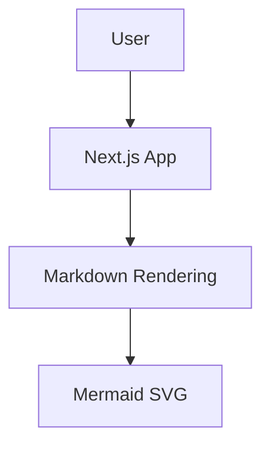
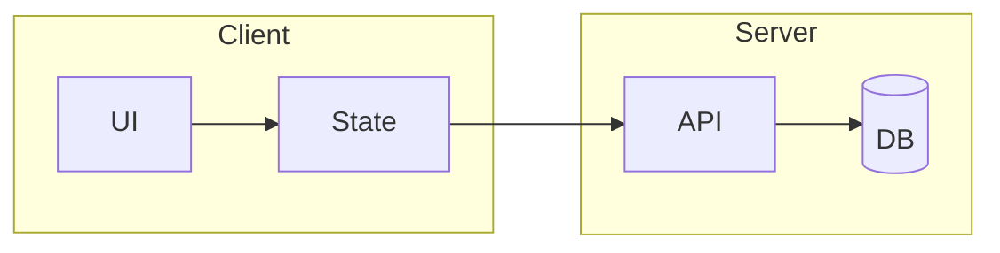
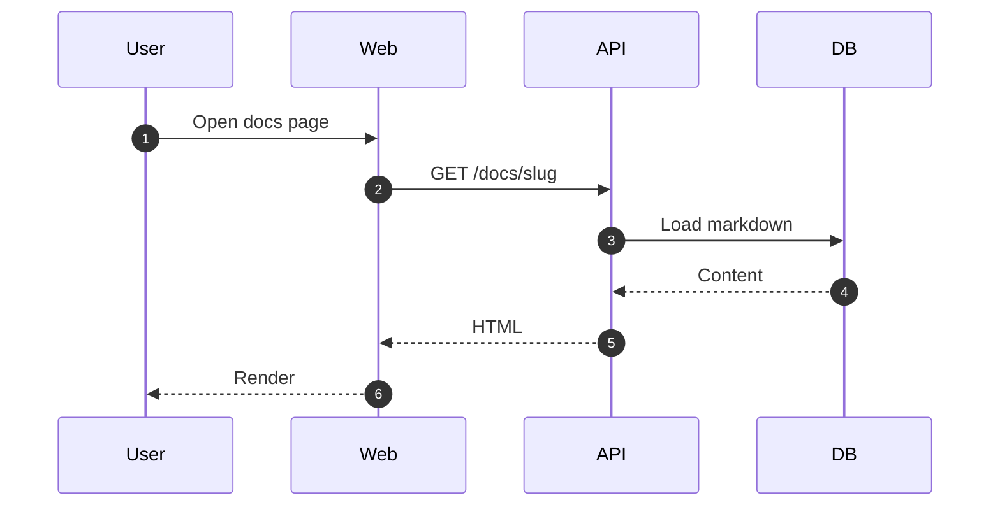
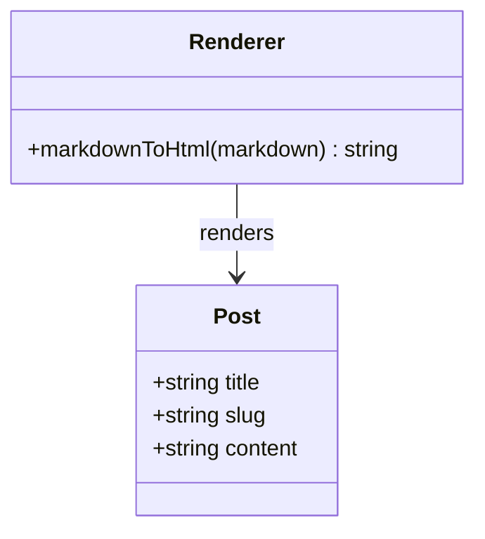
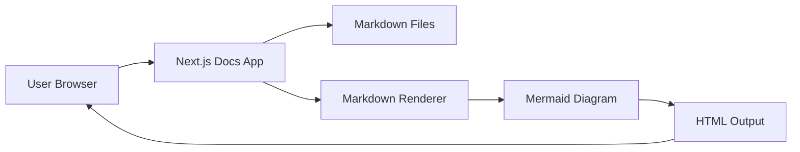
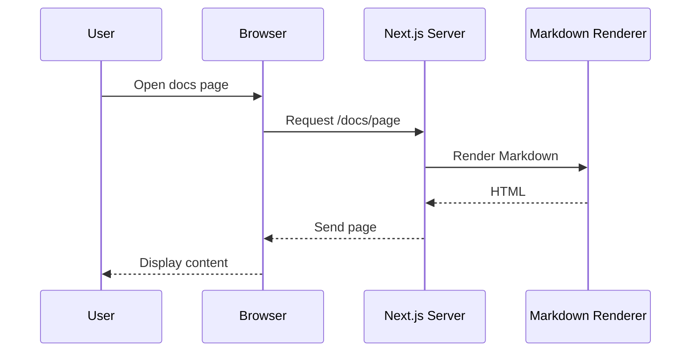
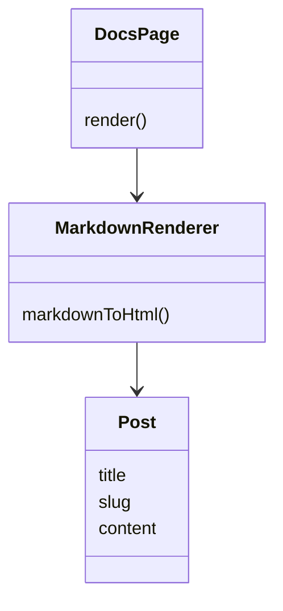

# my-dev-blog テンプレート（一式）

Next.js App Router / 静的エクスポート / GitHub Pages / Markdown 記事（ネストフォルダ・GFM・ダークUI対応）。
ライブラリ（node_modules）は含めていません。`npm install` で復元してください。

---

## `.github/workflows/deploy.yml`

```yaml
name: Deploy Next.js site to Pages

on:
  push:
    branches: ["main"]
  workflow_dispatch:

permissions:
  contents: read
  pages: write
  id-token: write

concurrency:
  group: "pages"
  cancel-in-progress: true

jobs:
  build:
    runs-on: ubuntu-latest
    steps:
      - name: Checkout
        uses: actions/checkout@v4

      - name: Setup Node
        uses: actions/setup-node@v4
        with:
          node-version: 20
          cache: "npm"

      - name: Install dependencies
        run: npm ci

      - name: Build
        run: npm run build

      - name: Upload artifact
        uses: actions/upload-pages-artifact@v3
        with:
          path: ./out

  deploy:
    environment:
      name: github-pages
      url: ${{ steps.deployment.outputs.page_url }}
    runs-on: ubuntu-latest
    needs: build
    steps:
      - name: Deploy to GitHub Pages
        id: deployment
        uses: actions/deploy-pages@v4
```

---

## `.gitignore`

```text
# See https://help.github.com/articles/ignoring-files/ for more about ignoring files.

# dependencies
/node_modules
/.pnp
.pnp.*
.yarn/*
!.yarn/patches
!.yarn/plugins
!.yarn/releases
!.yarn/versions

# testing
/coverage

# next.js
/.next/
/out/

# production
/build

# misc
.DS_Store
*.pem

# debug
npm-debug.log*
yarn-debug.log*
yarn-error.log*
.pnpm-debug.log*

# env files (can opt-in for committing if needed)
.env*

# vercel
.vercel

# typescript
*.tsbuildinfo
next-env.d.ts
```

---

## `app/docs/[...slug]/page.tsx`

```tsx
import { notFound } from "next/navigation";
import { getPostBySlug, getPosts } from "@/lib/posts";
import { extractHeadings, markdownToHtml } from "@/lib/markdown";
import { DocsLayout } from "@/components/docs-layout";
import type { Metadata } from "next";

export function generateStaticParams() {
  return getPosts().map((post) => ({
    slug: post.slug,
  }));
}

type Props = {
  params: Promise<{ slug: string[] }>;
};

export async function generateMetadata({ params }: Props): Promise<Metadata> {
  const { slug } = await params;
  const post = getPostBySlug(Array.isArray(slug) ? slug : [slug]);
  if (!post) return {};

  const title = `${post.title} | My Docs`;
  const description = post.description || undefined;

  return {
    title,
    description,
    openGraph: {
      title,
      description,
      type: "article",
    },
  };
}

function formatDate(dateString?: string): string | null {
  if (!dateString) return null;
  const timestamp = Date.parse(dateString);
  if (Number.isNaN(timestamp)) return dateString;

  try {
    return new Intl.DateTimeFormat("ja-JP", {
      year: "numeric",
      month: "short",
      day: "numeric",
    }).format(new Date(timestamp));
  } catch {
    return dateString;
  }
}

export default async function DocPage({ params }: Props) {
  const { slug } = await params;

  const posts = getPosts();
  const slugPath = Array.isArray(slug) ? slug.join("/") : slug;
  const exists = posts.some((post) => post.slugAsPath === slugPath);
  if (!exists) notFound();

  const post = getPostBySlug(Array.isArray(slug) ? slug : [slug]);
  if (!post) notFound();

  const contentHtml = await markdownToHtml(post.content);
  const headings = extractHeadings(post.content);
  const formattedDate = formatDate(post.date);

  return (
    <DocsLayout
      posts={posts}
      currentSlug={post.slugAsPath}
      headings={headings}
    >
      <article className="doc-article">
        <div className="doc-header">
          <p className="doc-category">{post.category}</p>
          <h1>{post.title}</h1>
          {formattedDate ? (
            <p className="doc-date">
              <time dateTime={post.date}>{formattedDate}</time>
            </p>
          ) : null}
          {post.description ? (
            <p className="doc-description">{post.description}</p>
          ) : null}
        </div>

        <div
          className="markdown-body"
          dangerouslySetInnerHTML={{ __html: contentHtml }}
        />
      </article>
    </DocsLayout>
  );
}
```

---

## `app/docs/page.tsx`

```tsx
import { getPosts } from "@/lib/posts";
import { DocsHomeShell } from "@/components/docs-home-shell";

export default function DocsIndexPage() {
  const posts = getPosts();
  return <DocsHomeShell posts={posts} />;
}
```

---

## `app/globals.css`

```css
:root {
  --bg: #0b1020;
  --bg-subtle: #111827;
  --panel: #1a2232;
  --panel-soft: #0f172a;
  --text: #e5e7eb;
  --muted: #94a3b8;
  --line: #243041;
  --accent: #7cc4ff;
  --accent-soft: rgba(124, 196, 255, 0.08);
  --accent-line: rgba(124, 196, 255, 0.42);
  --max: 1440px;

  /* スクロールバー色（共通） */
  --scrollbar-thumb: rgba(148, 163, 184, 0.24);
  --scrollbar-thumb-hover: rgba(148, 163, 184, 0.38);
  --scrollbar-track: transparent;
}

* {
  box-sizing: border-box;
}

html {
  scroll-behavior: smooth;
}

body {
  margin: 0;
  overflow-x: hidden;
  font-family: -apple-system, BlinkMacSystemFont, "Segoe UI", Helvetica, Arial,
    sans-serif;
  color: var(--text);
  background: var(--bg);
}

.docs-shell,
.docs-grid,
.content-rail,
.doc-article,
.markdown-body {
  min-width: 0;
}

a {
  color: inherit;
  text-decoration: none;
}

.topbar {
  position: sticky;
  top: 0;
  z-index: 20;
  display: flex;
  align-items: center;
  justify-content: space-between;
  gap: 16px;
  height: 64px;
  padding: 0 24px;
  border-bottom: 1px solid var(--line);
  background: var(--bg);
  backdrop-filter: blur(8px);
}

.topbar-brand {
  display: inline-flex;
  align-items: center;
  gap: 10px;
  font-size: 18px;
  font-weight: 700;
}

.topbar-logo {
  display: inline-flex;
  align-items: center;
  justify-content: center;
  width: 28px;
  height: 28px;
}

.topbar-logo img {
  display: block;
  width: 100%;
  height: 100%;
  object-fit: contain;
}

.topbar-title {
  display: inline-block;
}

.search-box {
  display: flex;
  align-items: center;
  gap: 10px;
  width: min(420px, 100%);
  min-height: 40px;
  padding: 0 12px;
  border: 1px solid var(--line);
  border-radius: 12px;
  background: var(--panel);
}

.search-icon {
  position: relative;
  flex: 0 0 auto;
  width: 14px;
  height: 14px;
  color: var(--muted);
}

.search-icon::before {
  content: "";
  position: absolute;
  inset: 0;
  width: 9px;
  height: 9px;
  border: 1.8px solid currentColor;
  border-radius: 999px;
}

.search-icon::after {
  content: "";
  position: absolute;
  right: 0;
  bottom: 0;
  width: 6px;
  height: 1.8px;
  background: currentColor;
  border-radius: 999px;
  transform: rotate(45deg);
  transform-origin: center;
}

.search-box:focus-within {
  border-color: var(--accent-line);
  box-shadow: 0 0 0 3px var(--accent-soft);
}

.search-box:focus-within .search-icon {
  color: var(--text);
}

.search-box input {
  width: 100%;
  border: 0;
  outline: 0;
  background: transparent;
  color: var(--text);
  font-size: 14px;
}

.search-box input::placeholder {
  color: var(--muted);
}

.docs-grid {
  display: grid;
  grid-template-columns: 350px minmax(0, 1fr) 240px;
  gap: 0;
  width: 100%;
  max-width: none;
  margin: 0;
  align-items: stretch;
}

.left-rail,
.right-rail {
  min-height: calc(100vh - 64px);
  padding: 0;
}

/* 左レール */
.left-rail {
  border-right: 1px solid var(--line);
  background: var(--bg-subtle);
}

/* 右レール（下まで背景） */
.right-rail {
  position: sticky;
  top: 64px;
  align-self: start;
  height: calc(100vh - 64px);
  min-height: calc(100vh - 64px);
  border-left: 1px solid var(--line);
  background: var(--panel-soft);
  overflow: hidden;
}

/* ここが重要: sidebar 本体の上下余白を 8px にする */
.sidebar {
  padding: 8px 20px;
}

.right-rail .toc {
  height: 100%;
  max-height: calc(100vh - 64px);
  overflow-y: auto;
  overflow-x: hidden;
  padding: 16px 14px 20px;
}

.content-rail {
  min-width: 0;
  padding: 40px 56px 80px;
}

.doc-article {
  max-width: 860px;
  width: 100%;
  margin: 0 auto;
}

.markdown-body .mermaid {
  display: flex;
  justify-content: center;
  margin: 0 0 20px;
  overflow-x: auto;
}

.markdown-body .mermaid svg {
  max-width: 100%;
  height: auto;
}

.sidebar-title,
.toc-title,
.eyebrow,
.doc-category,
.doc-card-category {
  margin: 0 0 12px;
  color: var(--muted);
  font-size: 12px;
  font-weight: 700;
  text-transform: uppercase;
  letter-spacing: 0.08em;
}

.sidebar ul,
.toc ul {
  margin: 0;
  padding: 0;
  list-style: none;
}

.sidebar li + li,
.toc li + li {
  margin-top: 4px;
}

/* サイドバー統一: 戻る・リンク・summary・子リンク */
.sidebar-back,
.sidebar a,
.sidebar-summary,
.sidebar-children a {
  min-height: 36px;
  min-width: 0;
}

.sidebar-back,
.sidebar a,
.sidebar-summary {
  display: flex;
  align-items: center;
}

.sidebar a,
.sidebar-summary,
.sidebar-children a,
.sidebar-back {
  border: 1px solid transparent;
  transition:
    background-color 0.15s ease,
    border-color 0.15s ease,
    color 0.15s ease;
}

.sidebar a:hover,
.sidebar-summary:hover,
.sidebar-children a:hover,
.sidebar-back:hover,
.toc a:hover {
  background: rgba(255, 255, 255, 0.035);
  border-color: transparent;
  color: var(--text);
}

.sidebar a,
.sidebar-children a {
  display: flex;
  align-items: center;
  min-width: 0;
  overflow: hidden;
}

.sidebar-link-text,
.sidebar-summary-label {
  display: block;
  min-width: 0;
  flex: 1;
  overflow: hidden;
  white-space: nowrap;
  text-overflow: ellipsis;
}

.sidebar a,
.sidebar-children a {
  position: relative;
  padding: 6px 10px 6px 14px;
  border-radius: 10px;
  color: var(--muted);
}

.sidebar a.active,
.sidebar-children a.active {
  background: var(--accent-soft);
  border-color: transparent;
  color: var(--text);
  font-weight: 600;
}

.sidebar a.active::before,
.sidebar-children a.active::before {
  content: "";
  position: absolute;
  left: 0;
  top: 6px;
  bottom: 6px;
  width: 2px;
  border-radius: 999px;
  background: rgba(124, 196, 255, 0.9);
}

.sidebar-back {
  margin-bottom: 16px;
  padding: 8px 10px;
  border-radius: 8px;
  color: var(--muted);
  font-size: 14px;
}

/* アコーディオン（フォルダ＝子あり） */
.sidebar-accordion {
  margin-top: 0;
}

.sidebar-details {
  margin: 0;
}

.sidebar-summary {
  position: relative;
  justify-content: space-between;
  gap: 12px;
  width: 100%;
  margin: 0;
  padding: 6px 10px 6px 14px;
  border-radius: 10px;
  color: var(--muted);
  font-size: 14px;
  font-weight: 600;
  cursor: pointer;
  list-style: none;
  user-select: none;
}

.sidebar-details[open] > .sidebar-summary {
  background: rgba(255, 255, 255, 0.02);
  color: var(--text);
}

.sidebar-details[open] > .sidebar-summary::before {
  content: "";
  position: absolute;
  left: 0;
  top: 6px;
  bottom: 6px;
  width: 2px;
  border-radius: 999px;
  background: rgba(255, 255, 255, 0.14);
}

.sidebar-summary::-webkit-details-marker {
  display: none;
}

/* .sidebar-summary-label の省略は .sidebar-link-text と共通で上で定義 */

/* 三角は CSS で描画（フォントずれ防止） */
.sidebar-summary-icon {
  flex: 0 0 auto;
  width: 10px;
  height: 10px;
  border-right: 1.5px solid currentColor;
  border-bottom: 1.5px solid currentColor;
  transform: rotate(45deg);
  margin-right: 2px;
  transition: transform 0.2s ease, color 0.2s ease;
  color: var(--muted);
  font-size: 0;
  overflow: hidden;
}

.sidebar-details[open] .sidebar-summary-icon {
  transform: rotate(45deg);
}

.sidebar-details:not([open]) .sidebar-summary-icon {
  transform: rotate(-45deg);
}

.sidebar-summary:hover .sidebar-summary-icon {
  color: var(--text);
}

.sidebar-children {
  margin: 2px 0 0 8px;
  padding: 4px 0 0 12px;
  list-style: none;
  border-left: 1px solid rgba(124, 196, 255, 0.32);
}

.sidebar-children .sidebar-children {
  margin-left: 10px;
  padding-left: 10px;
}

.sidebar-children li {
  margin: 0;
}

.sidebar-children li + li {
  margin-top: 2px;
}

.sidebar-children a {
  min-height: 32px;
  font-size: 14px;
}

.toc-title {
  margin: 0 0 14px;
  padding: 0 10px;
  color: var(--muted);
  font-size: 11px;
  font-weight: 700;
  letter-spacing: 0.08em;
  text-transform: uppercase;
}

.toc ul {
  margin: 0;
  padding: 0;
  list-style: none;
}

.toc li + li {
  margin-top: 2px;
}

.toc a {
  position: relative;
  display: block;
  padding: 6px 10px 6px 14px;
  border-radius: 10px;
  color: var(--muted);
  font-size: 13px;
  line-height: 1.45;
  transition:
    background-color 0.15s ease,
    color 0.15s ease;
}

.toc a[aria-current="true"] {
  background: rgba(124, 196, 255, 0.09);
  color: var(--text);
}

.toc .level-3 a {
  padding-left: 26px;
}

.breadcrumbs {
  margin: 0 0 16px;
}

.breadcrumbs-list {
  display: flex;
  flex-wrap: wrap;
  align-items: center;
  gap: 6px;
  list-style: none;
  padding: 0;
  margin: 0;
  color: var(--muted);
  font-size: 13px;
}

.breadcrumbs-item a {
  color: inherit;
}

.breadcrumbs-item a:hover {
  color: var(--text);
}

.breadcrumbs-inline {
  display: inline-flex;
  gap: 6px;
  align-items: center;
}

.breadcrumbs-sep {
  opacity: 0.55;
}

.toc-mobile {
  display: none;
  margin: 0 0 18px;
}

.toc-mobile-details {
  border: 1px solid var(--line);
  border-radius: 12px;
  background: var(--panel);
  overflow: hidden;
}

.toc-mobile-summary {
  padding: 12px 14px;
  cursor: pointer;
  user-select: none;
  color: var(--text);
  font-size: 14px;
  font-weight: 600;
  list-style: none;
}

.toc-mobile-summary::-webkit-details-marker {
  display: none;
}

.toc--mobile {
  padding: 0 10px 10px;
}

.doc-nav {
  margin-top: 40px;
  padding-top: 18px;
  border-top: 1px solid var(--line);
}

.doc-nav-inner {
  display: grid;
  grid-template-columns: 1fr 1fr;
  gap: 12px;
}

.doc-nav-link {
  display: block;
  padding: 14px 14px 12px;
  border: 1px solid rgba(255, 255, 255, 0.06);
  border-radius: 14px;
  background: linear-gradient(
    180deg,
    rgba(255, 255, 255, 0.03),
    rgba(255, 255, 255, 0.015)
  );
  transition:
    transform 0.18s ease,
    border-color 0.18s ease,
    background 0.18s ease;
}

.doc-nav-link:hover {
  transform: translateY(-1px);
  border-color: rgba(124, 196, 255, 0.18);
  background: linear-gradient(
    180deg,
    rgba(255, 255, 255, 0.045),
    rgba(255, 255, 255, 0.02)
  );
}

.doc-nav-kicker {
  display: block;
  margin: 0 0 6px;
  color: var(--muted);
  font-size: 11px;
  font-weight: 700;
  letter-spacing: 0.08em;
  text-transform: uppercase;
}

.doc-nav-title {
  display: block;
  color: var(--text);
  font-size: 14px;
  font-weight: 600;
  line-height: 1.4;
}

.doc-nav-link.next {
  text-align: right;
}


.home {
  padding: 48px 24px 80px;
}

.home-inner {
  max-width: 1120px;
  margin: 0 auto;
}

.home h1,
.doc-header h1 {
  margin: 0;
  font-size: clamp(36px, 5vw, 48px);
  line-height: 1.1;
}

.lead,
.doc-description {
  max-width: 720px;
  margin-top: 16px;
  color: var(--muted);
  font-size: 18px;
  line-height: 1.7;
}

.card-grid {
  display: grid;
  grid-template-columns: repeat(auto-fit, minmax(260px, 1fr));
  gap: 16px;
  margin-top: 32px;
}

/* カード類の共通文法 */
.recommended-card,
.article-card,
.help-card,
.doc-card {
  display: block;
  padding: 18px 18px 16px;
  border: 1px solid rgba(255, 255, 255, 0.06);
  border-radius: 14px;
  background: linear-gradient(
    180deg,
    rgba(255, 255, 255, 0.03),
    rgba(255, 255, 255, 0.015)
  );
  box-shadow: inset 0 1px 0 rgba(255, 255, 255, 0.02);
  transition:
    transform 0.18s ease,
    border-color 0.18s ease,
    background 0.18s ease;
}

.recommended-card:hover,
.article-card:hover,
.help-card:hover,
.doc-card:hover {
  transform: translateY(-1px);
  border-color: rgba(124, 196, 255, 0.18);
  background: linear-gradient(
    180deg,
    rgba(255, 255, 255, 0.045),
    rgba(255, 255, 255, 0.02)
  );
}

.recommended-card strong,
.article-card strong,
.help-card strong,
.doc-card strong {
  display: block;
  margin-bottom: 8px;
  color: var(--text);
  line-height: 1.4;
}

.recommended-card strong,
.article-card strong {
  overflow: hidden;
  white-space: nowrap;
  text-overflow: ellipsis;
}

.recommended-card p,
.article-card p,
.help-card p,
.doc-card p {
  margin: 0;
  color: var(--muted);
  line-height: 1.6;
}

.doc-card strong {
  font-size: 18px;
}

/* ========== GitHub Docs 風 ダークスタートページ ========== */

.docs-shell--dark .left-rail--dark {
  background: var(--bg-subtle);
}

.docs-grid--home {
  grid-template-columns: 350px minmax(0, 1fr);
  align-items: stretch;
}

/* ホーム・記事の両方で左レールを sticky の独立スクロールに */
.docs-grid--home > .left-rail,
.docs-grid > .left-rail {
  position: sticky;
  top: 64px;
  align-self: stretch;
  height: calc(100vh - 64px);
  min-height: calc(100vh - 64px);
  overflow-y: auto;
  overflow-x: hidden;
}

.left-rail,
.right-rail .toc,
.markdown-body pre {
  scrollbar-width: thin;
}

/* Firefox */
.left-rail,
.right-rail .toc {
  scrollbar-color: var(--scrollbar-thumb) var(--scrollbar-track);
}

/* WebKit */
.left-rail::-webkit-scrollbar,
.right-rail .toc::-webkit-scrollbar {
  width: 8px;
}

.left-rail::-webkit-scrollbar-track,
.right-rail .toc::-webkit-scrollbar-track {
  background: var(--scrollbar-track);
}

.left-rail::-webkit-scrollbar-thumb,
.right-rail .toc::-webkit-scrollbar-thumb {
  background: var(--scrollbar-thumb);
  border-radius: 999px;
  border: 2px solid transparent;
  background-clip: padding-box;
}

.left-rail::-webkit-scrollbar-thumb:hover,
.right-rail .toc::-webkit-scrollbar-thumb:hover {
  background: var(--scrollbar-thumb-hover);
  border: 2px solid transparent;
  background-clip: padding-box;
}

.content-rail--home {
  padding: 40px 48px 80px;
}

.docs-home {
  width: 100%;
  max-width: 1200px;
  margin: 0 auto;
  padding-bottom: 64px;
}

.section-title {
  margin: 0 0 20px;
  font-size: 20px;
  font-weight: 600;
  color: var(--text);
}

/* ヒーロー */
.hero {
  display: grid;
  grid-template-columns: 1fr minmax(200px, 360px);
  gap: 48px;
  align-items: center;
  margin-bottom: 48px;
  padding-bottom: 40px;
  border-bottom: 1px solid var(--line);
}

.hero-text .eyebrow {
  margin-bottom: 8px;
}

.hero-title {
  margin: 0;
  font-size: clamp(32px, 4vw, 42px);
  font-weight: 700;
  line-height: 1.2;
  color: var(--text);
}

.hero-lead {
  margin: 16px 0 0;
  max-width: 560px;
  font-size: 18px;
  line-height: 1.6;
  color: var(--muted);
}

.hero-image-placeholder {
  aspect-ratio: 16/10;
  display: flex;
  align-items: center;
  justify-content: center;
  border-radius: 12px;
  background: var(--panel);
  border: 1px dashed var(--line);
  color: var(--muted);
  font-size: 14px;
}

.hero-image-img {
  width: 100%;
  height: auto;
  border-radius: 12px;
  object-fit: cover;
}

/* 推奨カード */
.recommended {
  margin-bottom: 48px;
}

.recommended-grid {
  display: grid;
  grid-template-columns: repeat(3, 1fr);
  gap: 20px;
}

.recommended-card-category {
  display: block;
  margin-bottom: 8px;
  font-size: 11px;
  font-weight: 700;
  text-transform: uppercase;
  letter-spacing: 0.06em;
  color: var(--accent);
}

.recommended-card strong {
  font-size: 17px;
}

.recommended-card p {
  font-size: 14px;
}

/* 記事セクション */
.articles-section {
  margin-bottom: 48px;
}

.articles-header {
  display: flex;
  flex-wrap: wrap;
  align-items: center;
  justify-content: space-between;
  gap: 16px;
  margin-bottom: 20px;
}

.articles-toolbar {
  display: flex;
  flex-wrap: wrap;
  align-items: center;
  gap: 16px;
}

.filter-pills {
  display: flex;
  flex-wrap: wrap;
  gap: 8px;
}

.filter-pill,
.pagination-btn {
  display: inline-flex;
  align-items: center;
  justify-content: center;
  min-height: 36px;
  padding: 0 14px;
  border: 1px solid var(--line);
  border-radius: 999px;
  background: var(--bg);
  color: var(--muted);
  font-size: 13px;
  transition:
    border-color 0.15s ease,
    background-color 0.15s ease,
    color 0.15s ease;
}

.filter-pill {
  cursor: pointer;
}

.filter-pill:hover,
.pagination-btn:hover:not(:disabled) {
  border-color: #3d444d;
  background: var(--bg-subtle);
  color: var(--text);
}

.filter-pill.active,
.pagination-btn.active {
  background: var(--accent-soft);
  border-color: var(--accent-line);
  color: var(--accent);
}

.articles-search {
  min-width: 220px;
}

.articles-grid {
  display: grid;
  grid-template-columns: repeat(auto-fill, minmax(280px, 1fr));
  gap: 16px;
  margin-bottom: 24px;
}

.article-card-category {
  display: block;
  margin-bottom: 6px;
  font-size: 11px;
  font-weight: 700;
  text-transform: uppercase;
  letter-spacing: 0.06em;
  color: var(--muted);
}

.article-card strong {
  font-size: 16px;
}

/* ページネーション（モック） */
.pagination {
  display: flex;
  flex-wrap: wrap;
  align-items: center;
  justify-content: space-between;
  gap: 16px;
  padding-top: 20px;
  border-top: 1px solid var(--line);
}

.pagination-info {
  font-size: 14px;
  color: var(--muted);
}

.pagination-buttons {
  display: flex;
  gap: 8px;
}

.pagination-btn {
  cursor: pointer;
}

.pagination-btn:disabled {
  opacity: 0.5;
  cursor: not-allowed;
}

.pagination-page-indicator {
  display: flex;
  align-items: center;
  padding: 0 8px;
  font-size: 13px;
  color: var(--muted);
}

.empty-state {
  padding: 48px 24px;
  text-align: center;
  border: 1px solid var(--line);
  border-radius: 12px;
  background: var(--panel);
}

.empty-state strong {
  display: block;
  margin-bottom: 8px;
  color: var(--text);
}

.empty-state p {
  margin: 0;
  color: var(--muted);
}

/* ヘルプセクション */
.help-section {
  padding-top: 40px;
  border-top: 1px solid var(--line);
}

.help-grid {
  display: grid;
  grid-template-columns: repeat(auto-fit, minmax(240px, 1fr));
  gap: 20px;
}

.help-card strong {
  font-size: 16px;
}

@media (max-width: 900px) {
  .hero {
    grid-template-columns: 1fr;
  }

  .hero-image {
    order: -1;
    max-width: 320px;
  }

  .recommended-grid {
    grid-template-columns: 1fr;
  }
}


.doc-header {
  margin-bottom: 28px;
}

.doc-date {
  margin-top: 6px;
  color: var(--muted);
  font-size: 13px;
}

.markdown-body {
  min-width: 0;
  font-size: 16px;
  line-height: 1.8;
  word-break: break-word;
  overflow-wrap: anywhere;
  background: transparent !important;
}

/* インラインコード（pre 直下以外） */
.markdown-body :not(pre) > code {
  padding: 0.2em 0.4em;
  border-radius: 6px;
  background: rgba(110, 118, 129, 0.22);
  color: #e6edf3;
  font-family: ui-monospace, SFMono-Regular, Menlo, Consolas,
    "Liberation Mono", monospace;
  font-size: 0.875em;
}

/* コードブロック外枠 */
.markdown-body pre {
  overflow-x: auto;
  max-width: 100%;
  margin: 0 0 16px;
  padding: 16px 0;
  border: 1px solid #30363d;
  border-radius: 12px;
  background: #0d1117;
}

/* コードブロックの横スクロールバーをダーク対応 */
.markdown-body pre {
  scrollbar-width: thin;
  scrollbar-color: rgba(110, 118, 129, 0.45) #0d1117;
}

.markdown-body pre::-webkit-scrollbar {
  height: 10px;
  width: 10px;
}

.markdown-body pre::-webkit-scrollbar-track {
  background: #0d1117;
  border-radius: 999px;
}

.markdown-body pre::-webkit-scrollbar-thumb {
  background: rgba(110, 118, 129, 0.4);
  border-radius: 999px;
  border: 2px solid #0d1117;
}

.markdown-body pre::-webkit-scrollbar-thumb:hover {
  background: rgba(110, 118, 129, 0.6);
}

.markdown-body pre::-webkit-scrollbar-corner {
  background: #0d1117;
}

/* code 本体（可変ガター付き） */
.markdown-body pre code {
  --code-side-pad: 8px;
  --line-number-width: 3ch;
  --line-number-gap: 6px;
  --code-gutter: calc(var(--line-number-width) + var(--line-number-gap));

  display: grid;
  min-width: max-content;
  background: transparent;
  padding: 0 var(--code-side-pad);
  color: inherit;
  font-size: 0.875em;
  line-height: 1.7;
  counter-reset: line;
  white-space: pre;
}

/* 各行 */
.markdown-body pre code > [data-line] {
  display: block;
  position: relative;
  min-height: 1.7em;
  padding: 0 var(--code-side-pad)
    0 calc(var(--code-gutter) + var(--code-side-pad));
  counter-increment: line;
}

/* 行番号 */
.markdown-body pre code > [data-line]::before {
  content: counter(line);
  position: absolute;
  top: 0;
  left: 0;
  width: var(--line-number-width);
  margin-left: var(--code-side-pad);
  padding-right: var(--line-number-gap);
  color: #6e7681;
  text-align: right;
  user-select: none;
  font-variant-numeric: tabular-nums;
}

/* 空行も高さ維持 */
.markdown-body pre code > [data-line]:empty::after {
  content: " ";
}

/* ハイライト行 */
.markdown-body pre code > [data-highlighted-line] {
  background: rgba(56, 139, 253, 0.14);
  border-left: 2px solid #388bfd;
  padding-left: calc(var(--code-gutter) + var(--code-side-pad) - 2px);
}

.markdown-body pre code > [data-highlighted-line]::before {
  margin-left: calc(var(--code-side-pad) - 2px);
}

/* 単語ハイライト */
.markdown-body pre code [data-highlighted-chars] {
  border-radius: 4px;
  background: rgba(56, 139, 253, 0.18);
  padding: 0.1rem 0.25rem;
}

/* Shiki の inline style 背景だけ無効化 */
.markdown-body pre code span {
  background: transparent !important;
}

.markdown-body .heading-anchor {
  margin-left: 6px;
  color: var(--muted);
  font-size: 0.85em;
  text-decoration: none;
  opacity: 0;
  transition:
    opacity 0.12s ease-out,
    color 0.12s ease-out;
}

.markdown-body h2:hover .heading-anchor,
.markdown-body h3:hover .heading-anchor,
.markdown-body h4:hover .heading-anchor {
  opacity: 1;
  color: var(--accent);
}

/* title / figure 周り */
.markdown-body [data-rehype-pretty-code-figure] {
  margin: 0 0 16px;
}

.markdown-body [data-rehype-pretty-code-figure] pre {
  margin: 0;
}

.markdown-body [data-rehype-pretty-code-title] {
  padding: 10px 14px;
  border: 1px solid #30363d;
  border-bottom: 0;
  background: #161b22;
  color: #c9d1d9;
  font-size: 13px;
}

.markdown-body [data-rehype-pretty-code-title] + pre {
  border-top-left-radius: 0;
  border-top-right-radius: 0;
}

/* wrapper */
.code-block-wrapper {
  position: relative;
  margin: 0 0 16px;
}

.code-block-wrapper [data-rehype-pretty-code-figure] {
  margin: 0;
}

/* copy button */
.copy-button {
  position: absolute;
  top: 10px;
  right: 10px;
  z-index: 2;
  display: inline-flex;
  align-items: center;
  justify-content: center;
  min-width: 64px;
  height: 30px;
  padding: 0 10px;
  border: 1px solid #30363d;
  border-radius: 8px;
  background: rgba(33, 38, 45, 0.92);
  color: #c9d1d9;
  font-size: 12px;
  line-height: 1;
  cursor: pointer;
  transition:
    transform 0.15s ease,
    box-shadow 0.15s ease,
    background-color 0.15s ease,
    border-color 0.15s ease,
    color 0.15s ease;
  box-shadow: 0 0 0 1px rgba(48, 54, 61, 0.6);
}

.copy-button:hover {
  background: #30363d;
  border-color: #484f58;
  transform: translateY(-1px);
  box-shadow:
    0 0 0 1px rgba(56, 139, 253, 0.7),
    0 8px 18px rgba(0, 0, 0, 0.45);
}

.copy-button[data-copied="true"] {
  color: #3fb950;
  border-color: rgba(63, 185, 80, 0.45);
}

@media (max-width: 800px) {
  .markdown-body pre code {
    --code-side-pad: 6px;
    --line-number-width: 2ch;
    --line-number-gap: 5px;
  }

  .copy-button {
    top: 8px;
    right: 8px;
    min-width: 56px;

    padding: 0 8px;
    font-size: 11px;
  }
}

/* GitHub Alerts */
.markdown-body .markdown-alert {
  margin: 0 0 16px;
  padding: 0.5rem 1rem;
  border-left: 0.25em solid #3d444d;
  border-radius: 0;
  background: transparent;
  line-height: 1.7;
}

.markdown-body .markdown-alert > :first-child {
  margin-top: 0;
}

.markdown-body .markdown-alert > :last-child {
  margin-bottom: 0;
}

.markdown-body .markdown-alert p {
  margin: 0 0 0.75rem;
}

.markdown-body .markdown-alert p + p {
  margin-top: 0.5rem;
}

.markdown-body .markdown-alert-title {
  display: flex;
  align-items: center;
  gap: 0.5rem;
  margin: 0 0 0.5rem;
  font-weight: 600;
  line-height: 1.25;
  font-size: 1rem;
}

.markdown-body .markdown-alert-title::before {
  content: "";
  flex: 0 0 16px;
  width: 16px;
  height: 16px;
  display: inline-block;
  background-color: currentColor;
  mask-repeat: no-repeat;
  mask-position: center;
  mask-size: contain;
  -webkit-mask-repeat: no-repeat;
  -webkit-mask-position: center;
  -webkit-mask-size: contain;
}

/* NOTE */
.markdown-body .markdown-alert-note {
  border-left-color: #4493f8;
}

.markdown-body .markdown-alert-note .markdown-alert-title {
  color: #4493f8;
}

.markdown-body .markdown-alert-note .markdown-alert-title::before {
  mask-image: url("https://cdn.jsdelivr.net/npm/lucide-static/icons/info.svg");
  -webkit-mask-image: url("https://cdn.jsdelivr.net/npm/lucide-static/icons/info.svg");
}

/* TIP */
.markdown-body .markdown-alert-tip {
  border-left-color: #3fb950;
}

.markdown-body .markdown-alert-tip .markdown-alert-title {
  color: #3fb950;
}

.markdown-body .markdown-alert-tip .markdown-alert-title::before {
  mask-image: url("https://cdn.jsdelivr.net/npm/lucide-static/icons/lightbulb.svg");
  -webkit-mask-image: url("https://cdn.jsdelivr.net/npm/lucide-static/icons/lightbulb.svg");
}

/* IMPORTANT */
.markdown-body .markdown-alert-important {
  border-left-color: #ab7df8;
}

.markdown-body .markdown-alert-important .markdown-alert-title {
  color: #ab7df8;
}

.markdown-body .markdown-alert-important .markdown-alert-title::before {
  mask-image: url("https://cdn.jsdelivr.net/npm/lucide-static/icons/badge-alert.svg");
  -webkit-mask-image: url("https://cdn.jsdelivr.net/npm/lucide-static/icons/badge-alert.svg");
}

/* WARNING */
.markdown-body .markdown-alert-warning {
  border-left-color: #d29922;
}

.markdown-body .markdown-alert-warning .markdown-alert-title {
  color: #d29922;
}

.markdown-body .markdown-alert-warning .markdown-alert-title::before {
  mask-image: url("https://cdn.jsdelivr.net/npm/lucide-static/icons/alert-triangle.svg");
  -webkit-mask-image: url("https://cdn.jsdelivr.net/npm/lucide-static/icons/alert-triangle.svg");
}

/* CAUTION */
.markdown-body .markdown-alert-caution {
  border-left-color: #f85149;
}

.markdown-body .markdown-alert-caution .markdown-alert-title {
  color: #f85149;
}

.markdown-body .markdown-alert-caution .markdown-alert-title::before {
  mask-image: url("https://cdn.jsdelivr.net/npm/lucide-static/icons/octagon-x.svg");
  -webkit-mask-image: url("https://cdn.jsdelivr.net/npm/lucide-static/icons/octagon-x.svg");
}

.markdown-body blockquote {
  margin: 0 0 16px;
  padding: 0 16px;
  border-left: 4px solid var(--line);
  color: var(--muted);
}

@media (max-width: 1080px) {
  .docs-grid {
    grid-template-columns: 240px minmax(0, 1fr);
  }

  .right-rail {
    display: none;
  }
}

@media (max-width: 800px) {
  .topbar {
    padding: 0 16px;
  }

  .docs-grid {
    grid-template-columns: 1fr;
  }

  .left-rail {
    display: none;
  }

  .content-rail {
    padding: 28px 20px 64px;
  }

  .toc-mobile {
    display: block;
  }

  .search-box {
    max-width: 220px;
  }

  .content-rail--home {
    padding: 28px 20px 64px;
  }

  .articles-header,
  .articles-toolbar {
    flex-direction: column;
    align-items: stretch;
  }

  .articles-search {
    min-width: 0;
  }
}

/* ===== 最小差分: 記事ページ検索 & パンくず ===== */
.topbar-search-area {
  position: relative;
  width: min(420px, 100%);
}

.topbar-search-area .search-box {
  width: 100%;
}

.topbar-search-results {
  position: absolute;
  top: calc(100% + 8px);
  left: 0;
  right: 0;
  z-index: 30;
  display: grid;
  gap: 6px;
  max-height: 320px;
  padding: 10px;
  border: 1px solid var(--line);
  border-radius: 14px;
  background: var(--panel);
  box-shadow: 0 12px 32px rgba(0, 0, 0, 0.28);
  overflow-y: auto;
}

.topbar-search-result {
  display: flex;
  flex-direction: column;
  align-items: flex-start;
  gap: 4px;
  width: 100%;
  padding: 10px 12px;
  border: 1px solid transparent;
  border-radius: 10px;
  background: transparent;
  color: var(--text);
  text-align: left;
  cursor: pointer;
}

.topbar-search-result:hover {
  background: rgba(255, 255, 255, 0.035);
  border-color: transparent;
}

.topbar-search-result strong {
  font-size: 14px;
  line-height: 1.4;
}

.topbar-search-result span,
.topbar-search-empty {
  color: var(--muted);
  font-size: 12px;
}

.topbar-search-empty {
  padding: 10px 12px;
}

.breadcrumbs ol {
  display: flex;
  flex-wrap: wrap;
  gap: 8px;
  margin: 0 0 20px;
  padding: 0;
  list-style: none;
  color: var(--muted);
  font-size: 13px;
}

.breadcrumbs li {
  display: inline-flex;
  align-items: center;
  gap: 8px;
}

.breadcrumbs li:not(:first-child)::before {
  content: "/";
  color: rgba(148, 163, 184, 0.5);
}

.breadcrumbs a {
  color: var(--muted);
}

.breadcrumbs a:hover {
  color: var(--text);
}

@media (max-width: 800px) {
  .topbar-search-area {
    width: min(220px, 100%);
  }
}

.markdown-body .mermaid,
.markdown-body svg[aria-roledescription="flowchart"],
.markdown-body svg[aria-roledescription="sequence"] {
  display: block;
  max-width: 100%;
  margin: 0 0 16px;
  overflow-x: auto;
}

.markdown-body svg {
  max-width: 100%;
  height: auto;
}

/* ===== Mermaid / Premium Dark Theme ===== */
.markdown-body .mermaid {
  display: flex;
  justify-content: center;
  align-items: center;
  margin: 0 0 28px;
  padding: 18px;
  overflow-x: auto;
  border: 1px solid rgba(255, 255, 255, 0.055);
  border-radius: 18px;
  background:
    radial-gradient(
      circle at top,
      rgba(255, 255, 255, 0.035),
      rgba(255, 255, 255, 0.012) 42%,
      rgba(255, 255, 255, 0.008) 100%
    ),
    linear-gradient(
      180deg,
      rgba(255, 255, 255, 0.018),
      rgba(255, 255, 255, 0.01)
    );
  box-shadow:
    inset 0 1px 0 rgba(255, 255, 255, 0.035),
    0 10px 30px rgba(0, 0, 0, 0.22);
  backdrop-filter: blur(6px);
}

.markdown-body .mermaid svg {
  display: block;
  max-width: 100%;
  height: auto;
}

.markdown-body .mermaid .node rect,
.markdown-body .mermaid .node circle,
.markdown-body .mermaid .node ellipse,
.markdown-body .mermaid .node polygon,
.markdown-body .mermaid .node path {
  stroke-width: 1.4px;
  filter: drop-shadow(0 6px 14px rgba(0, 0, 0, 0.16));
}

.markdown-body .mermaid .node rect,
.markdown-body .mermaid .label-container {
  rx: 12px;
  ry: 12px;
}

.markdown-body .mermaid .cluster rect {
  rx: 16px;
  ry: 16px;
  stroke-width: 1.1px;
  fill: rgba(255, 255, 255, 0.02) !important;
}

.markdown-body .mermaid .edgePath path,
.markdown-body .mermaid .flowchart-link,
.markdown-body .mermaid .messageLine0,
.markdown-body .mermaid .messageLine1 {
  stroke-width: 2px;
  stroke-linecap: round;
  stroke-linejoin: round;
}

.markdown-body .mermaid .arrowheadPath,
.markdown-body .mermaid marker path {
  stroke-width: 1px;
}

.markdown-body .mermaid text,
.markdown-body .mermaid .nodeLabel,
.markdown-body .mermaid .edgeLabel,
.markdown-body .mermaid .messageText,
.markdown-body .mermaid .labelText {
  letter-spacing: 0.01em;
  text-rendering: geometricPrecision;
}

.markdown-body .mermaid .edgeLabel,
.markdown-body .mermaid .labelBox {
  border-radius: 999px;
}

.markdown-body .mermaid .edgeLabel rect,
.markdown-body .mermaid .labelBox {
  fill: #111827 !important;
  opacity: 0.96;
}

.markdown-body .mermaid .actor {
  stroke-width: 1.4px;
}

.markdown-body .mermaid .actor-line,
.markdown-body .mermaid .lifeline {
  stroke-dasharray: 4 4;
  opacity: 0.7;
}

.markdown-body .mermaid .note {
  border-radius: 12px;
  filter: drop-shadow(0 6px 14px rgba(0, 0, 0, 0.14));
}

.markdown-body .mermaid foreignObject > div {
  border-radius: 12px;
}

@media (max-width: 800px) {
  .markdown-body .mermaid {
    margin-bottom: 22px;
    padding: 10px;
    border-radius: 14px;
  }

  .markdown-body .mermaid .node rect,
  .markdown-body .mermaid .label-container {
    rx: 10px;
    ry: 10px;
  }

  .markdown-body .mermaid .cluster rect {
    rx: 12px;
    ry: 12px;
  }
}
```

---

## `app/layout.tsx`

```tsx
import "./globals.css";
import "github-markdown-css/github-markdown-dark.css";
import type { Metadata } from "next";

export const metadata: Metadata = {
  title: "My Docs",
  description: "GitHub Docs inspired template",
};

export default function RootLayout({
  children,
}: Readonly<{ children: React.ReactNode }>) {
  return (
    <html lang="ja">
      <body>{children}</body>
    </html>
  );
}
```

---

## `app/page.tsx`

```tsx
import { getPosts } from "@/lib/posts";
import { DocsHomeShell } from "@/components/docs-home-shell";

export default function HomePage() {
  const posts = getPosts();
  return <DocsHomeShell posts={posts} />;
}
```

---

## `components/docs-home-shell.tsx`

```tsx
 "use client";

import Link from "next/link";
import { useMemo, useState } from "react";
import { DocsSidebar } from "@/components/docs-sidebar";
import { SearchBox } from "@/components/search-box";
import { DocsHome } from "@/components/docs-home";
import type { PostMeta } from "@/lib/posts";
import { basePath } from "@/lib/site";

export function DocsHomeShell({ posts }: { posts: PostMeta[] }) {
  const [query, setQuery] = useState("");

  const filteredPosts = useMemo(() => {
    const normalized = query.trim().toLowerCase();

    if (!normalized) return posts;

    return posts.filter((post) =>
      [post.title, post.description ?? "", post.category ?? "", post.slugAsPath]
        .join(" ")
        .toLowerCase()
        .includes(normalized)
    );
  }, [posts, query]);

  return (
    <div className="docs-shell docs-shell--dark">
      <header className="topbar topbar--dark">
        <Link href="/" className="topbar-brand" prefetch={false}>
          <span className="topbar-logo" aria-hidden="true">
            
          </span>
          <span className="topbar-title">My Docs</span>
        </Link>
        <SearchBox
          value={query}
          onChange={setQuery}
          placeholder="記事を検索する"
        />
      </header>

      <div className="docs-grid docs-grid--home">
        <aside className="left-rail left-rail--dark">
          <DocsSidebar posts={posts} currentSlug="" />
        </aside>

        <main className="content-rail content-rail--home">
          <DocsHome posts={filteredPosts} />
        </main>
      </div>
    </div>
  );
}
```

---

## `components/docs-home.tsx`

```tsx
 "use client";

import Link from "next/link";
import { useMemo, useState } from "react";
import type { PostMeta } from "@/lib/posts";
import { basePath } from "@/lib/site";

const PAGE_SIZE = 12;

export function DocsHome({ posts }: { posts: PostMeta[] }) {
  const recommended = posts.slice(0, 3);

  const categories = useMemo(
    () =>
      [
        "すべて",
        ...Array.from(
          new Set(
            posts
              .map((p) => p.category)
              .filter((c): c is string => typeof c === "string" && c.length > 0)
          )
        ),
      ],
    [posts]
  );

  const [activeCategory, setActiveCategory] = useState("すべて");
  const [page, setPage] = useState(1);

  const filteredPosts = useMemo(() => {
    return posts.filter(
      (post) =>
        activeCategory === "すべて" || post.category === activeCategory
    );
  }, [posts, activeCategory]);

  const totalPages = Math.max(1, Math.ceil(filteredPosts.length / PAGE_SIZE));
  const safePage = Math.min(page, totalPages);

  const paginatedPosts = useMemo(() => {
    const start = (safePage - 1) * PAGE_SIZE;
    return filteredPosts.slice(start, start + PAGE_SIZE);
  }, [filteredPosts, safePage]);

  const startIndex =
    filteredPosts.length === 0 ? 0 : (safePage - 1) * PAGE_SIZE + 1;
  const endIndex =
    filteredPosts.length === 0
      ? 0
      : Math.min(safePage * PAGE_SIZE, filteredPosts.length);

  function handleCategoryChange(category: string) {
    setActiveCategory(category);
    setPage(1);
  }

  return (
    <div className="docs-home">
      <section className="hero">
        <div className="hero-text">
          <p className="eyebrow">ドキュメント</p>
          <h1 className="hero-title">Get started</h1>
          <p className="hero-lead">
            プロダクトや開発環境のセットアップ手順を、素早く見つけられるドキュメントサイトです。
          </p>
        </div>
        <div className="hero-image">
          
        </div>
      </section>

      <section className="recommended">
        <h2 className="section-title">推奨</h2>
        <div className="recommended-grid">
          {recommended.map((post) => (
            <Link
              key={post.slugAsPath}
              href={`/docs/${post.slugAsPath}/`}
              className="recommended-card"
              prefetch={false}
            >
              <span className="recommended-card-category">{post.category}</span>
              <strong title={post.title}>{post.title}</strong>
              <p>{post.description}</p>
            </Link>
          ))}
        </div>
      </section>

      <section className="articles-section">
        <div className="articles-header">
          <h2 className="section-title">記事</h2>

          <div className="articles-toolbar">
            <div
              className="filter-pills"
              role="group"
              aria-label="カテゴリで絞り込み"
            >
              {categories.map((cat) => (
                <button
                  key={cat}
                  type="button"
                  className={`filter-pill ${activeCategory === cat ? "active" : ""}`}
                  onClick={() => handleCategoryChange(cat)}
                >
                  {cat}
                </button>
              ))}
            </div>
          </div>
        </div>

        {filteredPosts.length === 0 ? (
          <div className="empty-state">
            <strong>記事が見つかりませんでした</strong>
            <p>カテゴリを変えるか、右上の検索でキーワードを試してみてください。</p>
          </div>
        ) : (
          <>
            <div className="articles-grid">
              {paginatedPosts.map((post) => (
                <Link
                  key={post.slugAsPath}
                  href={`/docs/${post.slugAsPath}/`}
                  className="article-card"
                  prefetch={false}
                >
                  <span className="article-card-category">{post.category}</span>
                  <strong title={post.title}>{post.title}</strong>
                  <p>{post.description}</p>
                </Link>
              ))}
            </div>

            <nav className="pagination" aria-label="ページネーション">
              <span className="pagination-info">
                {startIndex}–{endIndex} / {filteredPosts.length} 件を表示
              </span>

              <div className="pagination-buttons">
                <button
                  type="button"
                  className="pagination-btn"
                  disabled={safePage <= 1}
                  onClick={() => setPage((p) => Math.max(1, p - 1))}
                >
                  前へ
                </button>

                <span className="pagination-page-indicator">
                  {safePage} / {totalPages}
                </span>

                <button
                  type="button"
                  className="pagination-btn"
                  disabled={safePage >= totalPages}
                  onClick={() => setPage((p) => Math.min(totalPages, p + 1))}
                >
                  次へ
                </button>
              </div>
            </nav>
          </>
        )}
      </section>

      <section className="help-section">
        <h2 className="section-title">ヘルプ & サポート</h2>
        <div className="help-grid">
          <div className="help-card">
            <strong>ドキュメント</strong>
            <p>使い方や設定手順はこちらから探せます。</p>
          </div>
          <div className="help-card">
            <strong>よくある質問</strong>
            <p>よくある質問と回答をまとめています。</p>
          </div>
          <div className="help-card">
            <strong>お問い合わせ</strong>
            <p>問題が解決しない場合はご連絡ください。</p>
          </div>
        </div>
      </section>
    </div>
  );
}
```

---

## `components/docs-layout.tsx`

```tsx
 "use client";

import Link from "next/link";
import { useEffect, useMemo, useState, type KeyboardEvent } from "react";
import { useRouter } from "next/navigation";
import { DocsSidebar } from "@/components/docs-sidebar";
import { DocsToc } from "@/components/docs-toc";
import { SearchBox } from "@/components/search-box";
import type { PostMeta } from "@/lib/posts";
import type { Heading } from "@/lib/markdown";
import { basePath } from "@/lib/site";

export function DocsLayout({
  posts,
  currentSlug,
  headings,
  children,
}: {
  posts: PostMeta[];
  currentSlug: string;
  headings: Heading[];
  children: React.ReactNode;
}) {
  const router = useRouter();
  const [query, setQuery] = useState("");

  const filteredPosts = useMemo(() => {
    const normalized = query.trim().toLowerCase();
    if (!normalized) return posts.slice(0, 8);

    return posts
      .filter((post) =>
        [post.title, post.description ?? "", post.category ?? "", post.slugAsPath]
          .join(" ")
          .toLowerCase()
          .includes(normalized)
      )
      .slice(0, 8);
  }, [posts, query]);

  const handleSearchKeyDown = (event: KeyboardEvent<HTMLInputElement>) => {
    if (event.key === "Enter") {
      const first = filteredPosts[0];
      if (!first) return;
      setQuery("");
      router.push(`/docs/${first.slugAsPath}/`);
    }

    if (event.key === "Escape") {
      setQuery("");
      event.currentTarget.blur();
    }
  };

  useEffect(() => {
    const figures = Array.from(
      document.querySelectorAll<HTMLElement>(
        ".markdown-body [data-rehype-pretty-code-figure]"
      )
    );

    figures.forEach((figure) => {
      if (figure.dataset.hasCodeEnhancer === "true") return;

      const pre = figure.querySelector<HTMLPreElement>("pre");
      const code = figure.querySelector<HTMLElement>("pre code");
      if (!pre || !code) return;

      const wrapper = document.createElement("div");
      wrapper.className = "code-block-wrapper";

      const button = document.createElement("button");
      button.type = "button";
      button.className = "copy-button";
      button.textContent = "Copy";
      button.setAttribute("aria-label", "コードをコピー");

      button.addEventListener("click", async () => {
        try {
          const text = Array.from(
            code.querySelectorAll<HTMLElement>("[data-line]")
          )
            .map((line) => line.textContent ?? "")
            .join("\n");

          await navigator.clipboard.writeText(text || code.textContent || "");

          button.dataset.copied = "true";
          button.textContent = "Copied";

          window.setTimeout(() => {
            button.dataset.copied = "false";
            button.textContent = "Copy";
          }, 1600);
        } catch {
          button.textContent = "Failed";
          window.setTimeout(() => {
            button.textContent = "Copy";
          }, 1600);
        }
      });

      figure.parentNode?.insertBefore(wrapper, figure);
      wrapper.appendChild(figure);
      wrapper.appendChild(button);

      figure.dataset.hasCodeEnhancer = "true";
    });
  }, []);

  useEffect(() => {
    let cancelled = false;

    async function renderMermaid() {
      const mermaidBlocks = Array.from(
        document.querySelectorAll<HTMLElement>(".markdown-body .mermaid")
      );

      if (mermaidBlocks.length === 0) return;

      const mermaidModule = await import("mermaid");
      if (cancelled) return;

      const mermaid = mermaidModule.default;
      mermaid.initialize({
        startOnLoad: false,
        theme: "base",
        securityLevel: "strict",
        flowchart: {
          curve: "basis",
          htmlLabels: true,
          padding: 18,
          nodeSpacing: 34,
          rankSpacing: 42,
        },
        sequence: {
          useMaxWidth: true,
          wrap: true,
          diagramMarginX: 24,
          diagramMarginY: 16,
          actorMargin: 40,
          messageMargin: 28,
        },
        themeVariables: {
          background: "#0b1020",
          fontFamily:
            '-apple-system, BlinkMacSystemFont, "Segoe UI", Helvetica, Arial, sans-serif',
          fontSize: "14px",
          textColor: "#e5e7eb",

          primaryColor: "#182334",
          primaryTextColor: "#e5e7eb",
          primaryBorderColor: "#8fb7d8",

          secondaryColor: "#111827",
          secondaryTextColor: "#dbe4ee",
          secondaryBorderColor: "#4b5f77",

          tertiaryColor: "#0f172a",
          tertiaryTextColor: "#d7e0ea",
          tertiaryBorderColor: "#32465d",

          mainBkg: "#182334",
          secondBkg: "#111827",
          tertiaryBkg: "#0f172a",

          lineColor: "#88a9c7",
          defaultLinkColor: "#88a9c7",

          nodeBorder: "#8fb7d8",
          clusterBkg: "rgba(255,255,255,0.02)",
          clusterBorder: "#2a3a4f",

          edgeLabelBackground: "#111827",
          labelBackground: "#111827",

          actorBkg: "#182334",
          actorBorder: "#8fb7d8",
          actorTextColor: "#e5e7eb",
          actorLineColor: "#5c728a",
          signalColor: "#8fb7d8",
          signalTextColor: "#dbe4ee",

          sectionBkgColor: "rgba(255,255,255,0.02)",
          altSectionBkgColor: "rgba(255,255,255,0.03)",
          sectionBkg: "rgba(255,255,255,0.02)",

          cScale0: "#182334",
          cScale1: "#1d2a3d",
          cScale2: "#223149",
          cScale3: "#273854",
          cScale4: "#2c405f",
          cScale5: "#31476a",
          cScale6: "#374f75",
          cScale7: "#3d5780",
        },
      });

      await mermaid.run({
        nodes: mermaidBlocks,
      });
    }

    renderMermaid().catch((error) => {
      console.error("Mermaid render failed:", error);
    });

    return () => {
      cancelled = true;
    };
  }, [children]);

  const segments = currentSlug.split("/").filter(Boolean);

  return (
    <div className="docs-shell docs-shell--dark">
      <header className="topbar topbar--dark">
        <Link href="/" className="topbar-brand" prefetch={false}>
          <span className="topbar-logo" aria-hidden="true">
            
          </span>
          <span className="topbar-title">My Docs</span>
        </Link>

        <div className="topbar-search-area">
          <SearchBox
            value={query}
            onChange={setQuery}
            placeholder="記事を検索する"
            onKeyDown={handleSearchKeyDown}
          />
          {query ? (
            <div
              className="topbar-search-results"
              aria-label="検索候補"
            >
              {filteredPosts.length > 0 ? (
                filteredPosts.map((post) => (
                  <button
                    key={post.slugAsPath}
                    type="button"
                    className="topbar-search-result"
                    onClick={() => {
                      setQuery("");
                      router.push(`/docs/${post.slugAsPath}/`);
                    }}
                  >
                    <strong>{post.title}</strong>
                    <span>{post.category}</span>
                  </button>
                ))
              ) : (
                <div className="topbar-search-empty">記事が見つかりません</div>
              )}
            </div>
          ) : null}
        </div>
      </header>

      <div className="docs-grid">
        <aside className="left-rail left-rail--dark">
          <DocsSidebar posts={posts} currentSlug={currentSlug} />
        </aside>

        <main className="content-rail">
          <nav className="breadcrumbs" aria-label="パンくず">
            <ol>
              <li>
                <Link href="/" prefetch={false}>
                  Home
                </Link>
              </li>
              <li>
                <Link href="/docs/" prefetch={false}>
                  Docs
                </Link>
              </li>
              {segments.map((segment, index) => {
                const href = `/docs/${segments.slice(0, index + 1).join("/")}/`;
                const isLast = index === segments.length - 1;

                return (
                  <li key={href}>
                    {isLast ? (
                      <span aria-current="page">{segment}</span>
                    ) : (
                      <Link href={href} prefetch={false}>
                        {segment}
                      </Link>
                    )}
                  </li>
                );
              })}
            </ol>
          </nav>

          <div className="toc-mobile">
            <DocsToc headings={headings} variant="mobile" />
          </div>

          {children}
        </main>

        <aside className="right-rail">
          <DocsToc headings={headings} />
        </aside>
      </div>
    </div>
  );
}
```

---

## `components/docs-sidebar.tsx`

```tsx
import Link from "next/link";
import type { ReactNode } from "react";
import type { PostMeta } from "@/lib/posts";

type TreeNode = {
  name: string;
  path: string;
  children: Map<string, TreeNode>;
  childOrder: string[];
  post?: PostMeta;
};

function createNode(name: string, path: string): TreeNode {
  return {
    name,
    path,
    children: new Map(),
    childOrder: [],
  };
}

function buildTree(posts: PostMeta[]): TreeNode {
  const root = createNode("root", "");

  for (const post of posts) {
    let current = root;
    let currentPath = "";

    post.slug.forEach((segment, index) => {
      currentPath = currentPath ? `${currentPath}/${segment}` : segment;

      if (!current.children.has(segment)) {
        current.children.set(segment, createNode(segment, currentPath));
        current.childOrder.push(segment);
      }

      current = current.children.get(segment)!;

      if (index === post.slug.length - 1) {
        current.post = post;
      }
    });
  }

  return root;
}

function hasActiveDescendant(node: TreeNode, currentSlug: string): boolean {
  if (node.post?.slugAsPath === currentSlug) return true;

  for (const key of node.childOrder) {
    const child = node.children.get(key);
    if (child && hasActiveDescendant(child, currentSlug)) return true;
  }

  return false;
}

function orderedChildren(node: TreeNode): TreeNode[] {
  return node.childOrder
    .map((key) => node.children.get(key))
    .filter(Boolean) as TreeNode[];
}

function renderNodes(
  nodes: TreeNode[],
  currentSlug: string,
  level = 0
): ReactNode {
  return (
    <ul className={level === 0 ? "sidebar-list" : "sidebar-children"}>
      {nodes.map((node) => {
        const isLeaf = node.children.size === 0 && node.post;
        const active = node.post?.slugAsPath === currentSlug;
        const open = hasActiveDescendant(node, currentSlug);

        if (isLeaf) {
          return (
            <li key={node.path}>
              <Link
                href={`/docs/${node.post!.slugAsPath}/`}
                prefetch={false}
                className={active ? "active" : ""}
                title={node.post!.title}
                aria-current={active ? "page" : undefined}
              >
                <span className="sidebar-link-text">{node.post!.title}</span>
              </Link>
            </li>
          );
        }

        return (
          <li key={node.path} className="sidebar-accordion">
            <details className="sidebar-details" open={open}>
              <summary className="sidebar-summary">
                <span className="sidebar-summary-label" title={node.name}>
                  {node.name}
                </span>
                <span className="sidebar-summary-icon" aria-hidden />
              </summary>

              {renderNodes(orderedChildren(node), currentSlug, level + 1)}
            </details>
          </li>
        );
      })}
    </ul>
  );
}

export function DocsSidebar({
  posts,
  currentSlug,
}: {
  posts: PostMeta[];
  currentSlug: string;
}) {
  const tree = buildTree(posts);
  const rootNodes = orderedChildren(tree);

  return (
    <nav className="sidebar">
      <Link href="/" className="sidebar-back" prefetch={false}>
        ← ホーム
      </Link>

      <p className="sidebar-title">Get started</p>

      {renderNodes(rootNodes, currentSlug)}
    </nav>
  );
}
```

---

## `components/docs-toc.tsx`

```tsx
 "use client";

import type { Heading } from "@/lib/markdown";
import { useEffect, useMemo, useState } from "react";

export function DocsToc({
  headings,
  variant = "desktop",
}: {
  headings: Heading[];
  variant?: "desktop" | "mobile";
}) {
  const ids = useMemo(() => headings.map((h) => h.id), [headings]);
  const [activeId, setActiveId] = useState<string | null>(null);
  const [mobileOpen, setMobileOpen] = useState(false);

  useEffect(() => {
    if (typeof window === "undefined") return;
    if (!ids.length) return;

    const elements = ids
      .map((id) => document.getElementById(id))
      .filter((el): el is HTMLElement => !!el);
    if (!elements.length) return;

    const observer = new IntersectionObserver(
      (entries) => {
        const visible = entries
          .filter((e) => e.isIntersecting)
          .sort(
            (a, b) =>
              (a.target as HTMLElement).offsetTop -
              (b.target as HTMLElement).offsetTop
          );
        if (visible[0]?.target?.id) setActiveId(visible[0].target.id);
      },
      {
        root: null,
        rootMargin: "-30% 0px -60% 0px",
        threshold: [0, 1],
      }
    );

    for (const el of elements) observer.observe(el);
    return () => observer.disconnect();
  }, [ids]);

  function TocList() {
    return (
      <ul>
        {headings.map((heading) => {
          const isActive = heading.id === activeId;
          return (
            <li key={heading.id} className={`level-${heading.level}`}>
              <a
                href={`#${heading.id}`}
                aria-current={isActive ? "true" : undefined}
                onClick={() => {
                  setActiveId(heading.id);
                  if (variant === "mobile") setMobileOpen(false);
                }}
              >
                {heading.text}
              </a>
            </li>
          );
        })}
      </ul>
    );
  }

  if (variant === "mobile") {
    if (!headings.length) return null;
    return (
      <details
        className="toc-mobile-details"
        open={mobileOpen}
        onToggle={(e) =>
          setMobileOpen((e.currentTarget as HTMLDetailsElement).open)
        }
      >
        <summary className="toc-mobile-summary">このページの内容</summary>
        <div className="toc toc--mobile">
          <TocList />
        </div>
      </details>
    );
  }

  return (
    <div className="toc">
      <p className="toc-title">このページの内容</p>
      <TocList />
    </div>
  );
}
```

---

## `components/search-box.tsx`

```tsx
import type React from "react";

type Props = {
  value?: string;
  onChange?: (value: string) => void;
  placeholder?: string;
  disabled?: boolean;
  onKeyDown?: React.KeyboardEventHandler<HTMLInputElement>;
};

export function SearchBox({
  value = "",
  onChange,
  placeholder = "検索する",
  disabled = false,
  onKeyDown,
}: Props) {
  return (
    <label className="search-box" aria-label="記事を検索">
      <span className="search-icon" aria-hidden />
      <input
        type="search"
        placeholder={placeholder}
        value={value}
        onChange={(e) => onChange?.(e.target.value)}
        disabled={disabled}
        onKeyDown={onKeyDown}
      />
    </label>
  );
}
```

---

## `lib/markdown.ts`

```ts
import { remark } from "remark";
import remarkParse from "remark-parse";
import remarkGfm from "remark-gfm";
import remarkBreaks from "remark-breaks";
import remarkRehype from "remark-rehype";
import rehypeRaw from "rehype-raw";
import rehypeSanitize, { defaultSchema } from "rehype-sanitize";
import rehypeSlug from "rehype-slug";
import rehypeAutolinkHeadings from "rehype-autolink-headings";
import rehypePrettyCode from "rehype-pretty-code";
import rehypeStringify from "rehype-stringify";
import GithubSlugger from "github-slugger";
import { visit } from "unist-util-visit";
import type {
  Root as HastRoot,
  Element as HastElement,
  Text as HastText,
} from "hast";
import type { Root as MdastRoot, Blockquote, Paragraph, Text } from "mdast";

const ALERT_META: Record<
  string,
  {
    label: string;
    className: string;
  }
> = {
  NOTE: { label: "Note", className: "markdown-alert-note" },
  TIP: { label: "Tip", className: "markdown-alert-tip" },
  IMPORTANT: { label: "Important", className: "markdown-alert-important" },
  WARNING: { label: "Warning", className: "markdown-alert-warning" },
  CAUTION: { label: "Caution", className: "markdown-alert-caution" },
};

function remarkGitHubAlerts() {
  return (tree: MdastRoot) => {
    visit(tree, "blockquote", (node: Blockquote) => {
      const first = node.children[0];
      if (!first || first.type !== "paragraph") return;

      const firstParagraph = first as Paragraph;
      const firstChild = firstParagraph.children[0];
      if (!firstChild || firstChild.type !== "text") return;

      const textNode = firstChild as Text;
      const match = textNode.value.match(
        /^\[!(NOTE|TIP|IMPORTANT|WARNING|CAUTION)\]\s*/
      );

      if (!match) return;

      const alertType = match[1];
      const meta = ALERT_META[alertType];
      if (!meta) return;

      textNode.value = textNode.value.replace(match[0], "").trimStart();

      if (textNode.value.length === 0) {
        firstParagraph.children.shift();
      }

      while (
        firstParagraph.children.length > 0 &&
        firstParagraph.children[0].type === "break"
      ) {
        firstParagraph.children.shift();
      }

      if (firstParagraph.children.length === 0) {
        node.children.shift();
      }

      (node.data ??= {}).hName = "div";
      (node.data ??= {}).hProperties = {
        className: ["markdown-alert", meta.className],
      };

      node.children.unshift({
        type: "paragraph",
        data: {
          hName: "p",
          hProperties: {
            className: ["markdown-alert-title"],
          },
        },
        children: [
          {
            type: "text",
            value: meta.label,
          },
        ],
      } as Paragraph);
    });
  };
}

function rehypeExternalLinks() {
  return (tree: HastRoot) => {
    visit(tree, "element", (node: HastElement) => {
      if (node.tagName !== "a") return;

      const href = node.properties?.href;
      if (typeof href !== "string") return;
      if (href.startsWith("/") || href.startsWith("#")) return;

      node.properties = {
        ...node.properties,
        target: "_blank",
        rel: ["noreferrer", "noopener"],
      };
    });
  };
}

function rehypeMermaidBlocks() {
  return (tree: HastRoot) => {
    visit(tree, "element", (node: HastElement, index, parent) => {
      if (node.tagName !== "pre" || !parent || typeof index !== "number") {
        return;
      }

      const code = node.children[0] as HastElement | undefined;
      if (!code || code.type !== "element" || code.tagName !== "code") {
        return;
      }

      const className = code.properties?.className;
      const classes = Array.isArray(className) ? className : [];
      const isMermaid = classes.includes("language-mermaid");

      if (!isMermaid) return;

      const text = (code.children as HastText[])
        .filter((child) => child.type === "text")
        .map((child) => child.value)
        .join("");

      parent.children[index] = {
        type: "element",
        tagName: "div",
        properties: {
          className: ["mermaid"],
        },
        children: [
          {
            type: "text",
            value: text,
          },
        ],
      } as HastElement;
    });
  };
}

const SANITIZE_SCHEMA = {
  ...defaultSchema,
  clobberPrefix: "user-content-",
  tagNames: [
    ...((defaultSchema.tagNames ?? []) as string[]),
    "svg",
    "g",
    "path",
    "line",
    "rect",
    "circle",
    "ellipse",
    "polygon",
    "polyline",
    "marker",
    "defs",
    "pattern",
    "mask",
    "clipPath",
    "linearGradient",
    "radialGradient",
    "stop",
    "foreignObject",
    "text",
    "tspan",
  ],
  attributes: {
    ...(defaultSchema.attributes ?? {}),
    "*": [
      ...(((defaultSchema.attributes as any)?.["*"] as any[]) ?? []),
      "id",
      "className",
      "title",
      "ariaLabel",
      "ariaCurrent",
      "ariaHidden",
      "role",
      "style",
      /^data-[\w-]+$/i,
    ],
    svg: [
      "viewBox",
      "width",
      "height",
      "xmlns",
      "fill",
      "stroke",
      "stroke-width",
      "className",
      "role",
      "aria-labelledby",
      "ariaLabelledby",
    ],
    g: ["fill", "stroke", "className", "transform"],
    path: ["d", "fill", "stroke", "stroke-width", "marker-start", "marker-end"],
    line: ["x1", "x2", "y1", "y2", "stroke", "stroke-width"],
    rect: [
      "x",
      "y",
      "width",
      "height",
      "rx",
      "ry",
      "fill",
      "stroke",
      "stroke-width",
    ],
    circle: ["cx", "cy", "r", "fill", "stroke", "stroke-width"],
    ellipse: ["cx", "cy", "rx", "ry", "fill", "stroke", "stroke-width"],
    polygon: ["points", "fill", "stroke", "stroke-width"],
    polyline: ["points", "fill", "stroke", "stroke-width"],
    marker: [
      "id",
      "viewBox",
      "refX",
      "refY",
      "markerWidth",
      "markerHeight",
      "orient",
    ],
    defs: [],
    pattern: ["id", "width", "height", "patternUnits"],
    mask: ["id"],
    clipPath: ["id"],
    linearGradient: ["id", "x1", "x2", "y1", "y2"],
    radialGradient: ["id", "cx", "cy", "r", "fx", "fy"],
    stop: ["offset", "stop-color", "stop-opacity", "stopColor", "stopOpacity"],
    foreignObject: ["x", "y", "width", "height"],
    text: [
      "x",
      "y",
      "fill",
      "font-size",
      "font-family",
      "text-anchor",
      "dominant-baseline",
      "fontSize",
      "fontFamily",
      "textAnchor",
      "dominantBaseline",
    ],
    tspan: ["x", "y", "dx", "dy"],
    a: [
      ...(((defaultSchema.attributes as any)?.a as any[]) ?? []),
      "href",
      "target",
      "rel",
    ],
    code: [
      ...(((defaultSchema.attributes as any)?.code as any[]) ?? []),
      "className",
    ],
    pre: [
      ...(((defaultSchema.attributes as any)?.pre as any[]) ?? []),
      "className",
    ],
    span: [
      ...(((defaultSchema.attributes as any)?.span as any[]) ?? []),
      "className",
    ],
    div: [
      ...(((defaultSchema.attributes as any)?.div as any[]) ?? []),
      "className",
    ],
    p: [
      ...(((defaultSchema.attributes as any)?.p as any[]) ?? []),
      "className",
    ],
    h2: [
      ...(((defaultSchema.attributes as any)?.h2 as any[]) ?? []),
      "id",
      "className",
    ],
    h3: [
      ...(((defaultSchema.attributes as any)?.h3 as any[]) ?? []),
      "id",
      "className",
    ],
    h4: [
      ...(((defaultSchema.attributes as any)?.h4 as any[]) ?? []),
      "id",
      "className",
    ],
  },
};

export async function markdownToHtml(markdown: string): Promise<string> {
  const result = await remark()
    .use(remarkParse)
    .use(remarkGfm)
    .use(remarkBreaks)
    .use(remarkGitHubAlerts)
    .use(remarkRehype, {
      allowDangerousHtml: true,
    })
    .use(rehypeRaw)
    .use(rehypeSlug)
    .use(rehypeAutolinkHeadings, {
      behavior: "append",
      properties: {
        ariaLabel: "見出しへのリンク",
        className: ["heading-anchor"],
      },
      content: {
        type: "text",
        value: "#",
      },
    })
    .use(rehypeExternalLinks)
    .use(rehypeMermaidBlocks)
    .use(rehypePrettyCode, {
      theme: "github-dark-default",
      keepBackground: false,
      defaultLang: "text",
    })
    .use(rehypeSanitize, SANITIZE_SCHEMA)
    .use(rehypeStringify, {
      allowDangerousHtml: true,
    })
    .process(markdown);

  return result.toString();
}

export type Heading = {
  level: number;
  text: string;
  id: string;
};

export function extractHeadings(markdown: string): Heading[] {
  const slugger = new GithubSlugger();

  return markdown
    .split("\n")
    .filter((line) => /^##\s+/.test(line) || /^###\s+/.test(line))
    .map((line) => {
      const level = line.startsWith("###") ? 3 : 2;
      const text = line.replace(/^###?\s+/, "").trim();
      const id = slugger.slug(text);

      return { level, text, id };
    });
}
```

---

## `lib/posts.ts`

```ts
import fs from "node:fs";
import path from "node:path";
import matter from "gray-matter";

export type PostMeta = {
  slug: string[];
  slugAsPath: string;
  title: string;
  description?: string;
  category?: string;
  date?: string;
  order?: number;
};

export type Post = PostMeta & {
  content: string;
};

const postsDirectory = path.join(process.cwd(), "posts");

function getMarkdownFiles(dir: string, baseDir = dir): string[] {
  const entries = fs.readdirSync(dir, { withFileTypes: true });

  return entries.flatMap((entry) => {
    const fullPath = path.join(dir, entry.name);

    if (entry.isDirectory()) {
      return getMarkdownFiles(fullPath, baseDir);
    }

    if (entry.isFile() && entry.name.endsWith(".md")) {
      return [path.relative(baseDir, fullPath)];
    }

    return [];
  });
}

export function getPosts(): PostMeta[] {
  const files = getMarkdownFiles(postsDirectory);

  return files
    .map((relativePath) => {
      const fullPath = path.join(postsDirectory, relativePath);
      const fileContents = fs.readFileSync(fullPath, "utf8");
      const { data } = matter(fileContents);

      const slugAsPath = relativePath.replace(/\.md$/, "").replace(/\\/g, "/");
      const slug = slugAsPath.split("/");

      return {
        slug,
        slugAsPath,
        title: data.title ?? slug[slug.length - 1],
        description: data.description ?? "",
        category: data.category ?? slug[0] ?? "Docs",
        date: data.date ?? "",
        order:
          typeof data.order === "number"
            ? data.order
            : typeof data.order === "string" && data.order.trim()
              ? Number(data.order)
              : undefined,
      };
    })
    .sort((a, b) => {
      const aDate = a.date ? Date.parse(a.date) : NaN;
      const bDate = b.date ? Date.parse(b.date) : NaN;
      const aHasDate = Number.isFinite(aDate);
      const bHasDate = Number.isFinite(bDate);
      if (aHasDate && bHasDate && aDate !== bDate) return bDate - aDate;
      if (aHasDate !== bHasDate) return aHasDate ? -1 : 1;

      const aCat = a.slug[0] ?? "";
      const bCat = b.slug[0] ?? "";
      const catCmp = aCat.localeCompare(bCat, "ja");
      if (catCmp !== 0) return catCmp;

      const aDepth = a.slug.length;
      const bDepth = b.slug.length;
      if (aDepth !== bDepth) return aDepth - bDepth;

      const aOrder = typeof a.order === "number" && Number.isFinite(a.order) ? a.order : Infinity;
      const bOrder = typeof b.order === "number" && Number.isFinite(b.order) ? b.order : Infinity;
      if (aOrder !== bOrder) return aOrder - bOrder;

      const pathCmp = a.slugAsPath.localeCompare(b.slugAsPath, "ja");
      if (pathCmp !== 0) return pathCmp;

      return a.title.localeCompare(b.title, "ja");
    });
}

export function getPostBySlug(slugParts: string[]): Post | undefined {
  const fullPath = path.join(postsDirectory, ...slugParts) + ".md";
  if (!fs.existsSync(fullPath)) return undefined;

  const fileContents = fs.readFileSync(fullPath, "utf8");
  const { data, content } = matter(fileContents);

  return {
    slug: slugParts,
    slugAsPath: slugParts.join("/"),
    title: data.title ?? slugParts[slugParts.length - 1],
    description: data.description ?? "",
    category: data.category ?? slugParts[0] ?? "Docs",
    date: data.date ?? "",
    order:
      typeof data.order === "number"
        ? data.order
        : typeof data.order === "string" && data.order.trim()
          ? Number(data.order)
          : undefined,
    content,
  };
}
```

---

## `lib/site.ts`

```ts
export const basePath =
  process.env.NODE_ENV === "production" ? "/Pastel" : "";
```

---

## `next.config.ts`

```ts
import type { NextConfig } from "next";
import path from "path";

const isProd = process.env.NODE_ENV === "production";
const repo = "Pastel"; // リポジトリ名（GitHub: Vserval/Pastel）

// npm run dev をプロジェクトフォルダで実行している前提で、ここをルートにする
const projectRoot = path.resolve(process.cwd());

const nextConfig: NextConfig = {
  output: "export",
  trailingSlash: true,
  images: {
    unoptimized: true,
  },
  basePath: isProd ? `/${repo}` : "",
  assetPrefix: isProd ? `/${repo}/` : "",
  turbopack: {
    root: projectRoot,
  },
};

export default nextConfig;
```

---

## `package.json`

```json
{
  "name": "my-dev-blog",
  "version": "0.1.0",
  "private": true,
  "scripts": {
    "dev": "next dev",
    "build": "next build",
    "start": "next start",
    "lint": "eslint"
  },
  "dependencies": {
    "github-markdown-css": "^5.9.0",
    "github-slugger": "^2.0.0",
    "gray-matter": "^4.0.3",
    "mermaid": "^11.13.0",
    "next": "16.1.6",
    "react": "19.2.3",
    "react-dom": "19.2.3",
    "rehype-autolink-headings": "^7.1.0",
    "rehype-pretty-code": "^0.14.3",
    "rehype-raw": "^7.0.0",
    "rehype-sanitize": "^6.0.0",
    "rehype-slug": "^6.0.0",
    "rehype-stringify": "^10.0.1",
    "remark": "^15.0.1",
    "remark-breaks": "^4.0.0",
    "remark-gfm": "^4.0.1",
    "remark-html": "^16.0.1",
    "remark-parse": "^11.0.0",
    "remark-rehype": "^11.1.2",
    "shiki": "^4.0.2",
    "unist-util-visit": "^5.1.0"
  },
  "devDependencies": {
    "@tailwindcss/postcss": "^4",
    "@types/node": "^20",
    "@types/react": "^19",
    "@types/react-dom": "^19",
    "eslint": "^9",
    "eslint-config-next": "16.1.6",
    "tailwindcss": "^4",
    "typescript": "^5"
  }
}
```

---

## `posts/github-md-list.md`

`````md
# 基本的な書き込みと書式設定の構文

単純な構文を使用して、GitHubで散文とコードの高度な書式設定を作成します。

<!-- TRANSLATION_FALLBACK prop=markdown type=ParseError line=300 col=53 msg="tag 'データ' not found" -->
## Headings

To create a heading, add one to six <kbd>#</kbd> symbols before your heading text. The number of <kbd>#</kbd> you use will determine the hierarchy level and typeface size of the heading.

```markdown
# A first-level heading
## A second-level heading
### A third-level heading
```


When you use two or more headings, GitHub automatically generates a table of contents that you can access by clicking the "Outline" menu icon <svg version="1.1" width="16" height="16" viewBox="0 0 16 16" class="octicon octicon-list-unordered" aria-label="Table of Contents" role="img"><path d="M5.75 2.5h8.5a.75.75 0 0 1 0 1.5h-8.5a.75.75 0 0 1 0-1.5Zm0 5h8.5a.75.75 0 0 1 0 1.5h-8.5a.75.75 0 0 1 0-1.5Zm0 5h8.5a.75.75 0 0 1 0 1.5h-8.5a.75.75 0 0 1 0-1.5ZM2 14a1 1 0 1 1 0-2 1 1 0 0 1 0 2Zm1-6a1 1 0 1 1-2 0 1 1 0 0 1 2 0ZM2 4a1 1 0 1 1 0-2 1 1 0 0 1 0 2Z"></path></svg> within the file header. Each heading title is listed in the table of contents and you can click a title to navigate to the selected section.


## Styling text

You can indicate emphasis with bold, italic, strikethrough, subscript, or superscript text in comment fields and `.md` files.

| Style                  | Syntax              | Keyboard shortcut                                                                     | Example                                  | Output                                 |                                                   |
| ---------------------- | ------------------- | ------------------------------------------------------------------------------------- | ---------------------------------------- | -------------------------------------- | ------------------------------------------------- |
| Bold                   | `** **` or `__ __`  | <kbd>Command</kbd>+<kbd>B</kbd> (Mac) or <kbd>Ctrl</kbd>+<kbd>B</kbd> (Windows/Linux) | `**This is bold text**`                  | **This is bold text**                  |                                                   |
| Italic                 | `* *` or `_ _`      | <kbd>Command</kbd>+<kbd>I</kbd> (Mac) or <kbd>Ctrl</kbd>+<kbd>I</kbd> (Windows/Linux) | `_This text is italicized_`              | *This text is italicized*              |                                                   |
| Strikethrough          | `~~ ~~` or `~ ~`    | None                                                                                  | `~~This was mistaken text~~`             | ~~This was mistaken text~~             |                                                   |
| Bold and nested italic | `** **` and `_ _`   | None                                                                                  | `**This text is _extremely_ important**` | **This text is *extremely* important** |                                                   |
| All bold and italic    | `*** ***`           | None                                                                                  | `***All this text is important***`       | ***All this text is important***       | <!-- markdownlint-disable-line emphasis-style --> |
| Subscript              | `<sub> </sub>`      | None                                                                                  | `This is a <sub>subscript</sub> text`    | This is a <sub>subscript</sub> text    |                                                   |
| Superscript            | `<sup> </sup>`      | None                                                                                  | `This is a <sup>superscript</sup> text`  | This is a <sup>superscript</sup> text  |                                                   |
| Underline              | `<ins> </ins>`      | None                                                                                  | `This is an <ins>underlined</ins> text`  | This is an <ins>underlined</ins> text  |                                                   |

## Quoting text

You can quote text with a <kbd>></kbd>.

```markdown
Text that is not a quote

> Text that is a quote
```

Quoted text is indented with a vertical line on the left and displayed using gray type.


> \[!NOTE]
> When viewing a conversation, you can automatically quote text in a comment by highlighting the text, then typing <kbd>R</kbd>. You can quote an entire comment by clicking <svg version="1.1" width="16" height="16" viewBox="0 0 16 16" class="octicon octicon-kebab-horizontal" aria-label="The horizontal kebab icon" role="img"><path d="M8 9a1.5 1.5 0 1 0 0-3 1.5 1.5 0 0 0 0 3ZM1.5 9a1.5 1.5 0 1 0 0-3 1.5 1.5 0 0 0 0 3Zm13 0a1.5 1.5 0 1 0 0-3 1.5 1.5 0 0 0 0 3Z"></path></svg>, then **Quote reply**. For more information about keyboard shortcuts, see [Keyboard shortcuts](/en/get-started/accessibility/keyboard-shortcuts).

## Alerts (Callouts)

ブロック引用の先頭行に `> [!種類]` を書くと、GitHub ではアラート（注意書き）として表示されます。

> [!NOTE]
> Useful information that users should know, even when skimming content.

> [!TIP]
> Helpful advice for doing things better or more easily.

> [!IMPORTANT]
> Key information users need to know to achieve their goal.

> [!WARNING]
> Urgent info that needs immediate user attention to avoid problems.

> [!CAUTION]
> Advises about risks or negative outcomes of certain actions.

**構文（共通）:**

```markdown
> [!NOTE]
> 本文テキスト

> [!TIP]
> 本文テキスト

> [!IMPORTANT]
> 本文テキスト

> [!WARNING]
> 本文テキスト

> [!CAUTION]
> 本文テキスト
```

## Quoting code

You can call out code or a command within a sentence with single backticks. The text within the backticks will not be formatted. You can also press the <kbd>Command</kbd>+<kbd>E</kbd> (Mac) or <kbd>Ctrl</kbd>+<kbd>E</kbd> (Windows/Linux) keyboard shortcut to insert the backticks for a code block within a line of Markdown.

```markdown
Use `git status` to list all new or modified files that haven't yet been committed.
```


To format code or text into its own distinct block, use triple backticks.

````markdown
Some basic Git commands are:
```
git status
git add
git commit
```
````


For more information, see [Creating and highlighting code blocks](/en/get-started/writing-on-github/working-with-advanced-formatting/creating-and-highlighting-code-blocks).

If you are frequently editing code snippets and tables, you may benefit from enabling a fixed-width font in all comment fields on GitHub. For more information, see [About writing and formatting on GitHub](/en/get-started/writing-on-github/getting-started-with-writing-and-formatting-on-github/about-writing-and-formatting-on-github#enabling-fixed-width-fonts-in-the-editor).

## Supported color models

In issues, pull requests, and discussions, you can call out colors within a sentence by using backticks. A supported color model within backticks will display a visualization of the color.

```markdown
The background color is `#ffffff` for light mode and `#000000` for dark mode.
```


Here are the currently supported color models.

| Color | Syntax                      | Example                             | Output                                                                                                                                                                         |
| ----- | --------------------------- | ----------------------------------- | ------------------------------------------------------------------------------------------------------------------------------------------------------------------------------ |
| HEX   | <code>\`#RRGGBB\`</code>    | <code>\`#0969DA\`</code>            |        |
| RGB   | <code>\`rgb(R,G,B)\`</code> | <code>\`rgb(9, 105, 218)\`</code>   |    |
| HSL   | <code>\`hsl(H,S,L)\`</code> | <code>\`hsl(212, 92%, 45%)\`</code> |  |

> \[!NOTE]
>
> * A supported color model cannot have any leading or trailing spaces within the backticks.
> * The visualization of the color is only supported in issues, pull requests, and discussions.

## Links

You can create an inline link by wrapping link text in brackets `[ ]`, and then wrapping the URL in parentheses `( )`. You can also use the keyboard shortcut <kbd>Command</kbd>+<kbd>K</kbd> to create a link. When you have text selected, you can paste a URL from your clipboard to automatically create a link from the selection.

You can also create a Markdown hyperlink by highlighting the text and using the keyboard shortcut <kbd>Command</kbd>+<kbd>V</kbd>. If you'd like to replace the text with the link, use the keyboard shortcut <kbd>Command</kbd>+<kbd>Shift</kbd>+<kbd>V</kbd>.

`This site was built using [GitHub Pages](https://pages.github.com/).`


> \[!NOTE]
> GitHub automatically creates links when valid URLs are written in a comment. For more information, see [Autolinked references and URLs](/en/get-started/writing-on-github/working-with-advanced-formatting/autolinked-references-and-urls).

## Section links

You can link directly to any section that has a heading. To view the automatically generated anchor in a rendered file, hover over the section heading to expose the <svg version="1.1" width="16" height="16" viewBox="0 0 16 16" class="octicon octicon-link" aria-label="the link" role="img"><path d="m7.775 3.275 1.25-1.25a3.5 3.5 0 1 1 4.95 4.95l-2.5 2.5a3.5 3.5 0 0 1-4.95 0 .751.751 0 0 1 .018-1.042.751.751 0 0 1 1.042-.018 1.998 1.998 0 0 0 2.83 0l2.5-2.5a2.002 2.002 0 0 0-2.83-2.83l-1.25 1.25a.751.751 0 0 1-1.042-.018.751.751 0 0 1-.018-1.042Zm-4.69 9.64a1.998 1.998 0 0 0 2.83 0l1.25-1.25a.751.751 0 0 1 1.042.018.751.751 0 0 1 .018 1.042l-1.25 1.25a3.5 3.5 0 1 1-4.95-4.95l2.5-2.5a3.5 3.5 0 0 1 4.95 0 .751.751 0 0 1-.018 1.042.751.751 0 0 1-1.042.018 1.998 1.998 0 0 0-2.83 0l-2.5 2.5a1.998 1.998 0 0 0 0 2.83Z"></path></svg> icon and click the icon to display the anchor in your browser.


If you need to determine the anchor for a heading in a file you are editing, you can use the following basic rules:

* Letters are converted to lower-case.
* Spaces are replaced by hyphens (`-`). Any other whitespace or punctuation characters are removed.
* Leading and trailing whitespace are removed.
* Markup formatting is removed, leaving only the contents (for example, `_italics_` becomes `italics`).
* If the automatically generated anchor for a heading is identical to an earlier anchor in the same document, a unique identifier is generated by appending a hyphen and an auto-incrementing integer.

For more detailed information on the requirements of URI fragments, see [RFC 3986: Uniform Resource Identifier (URI): Generic Syntax, Section 3.5](https://www.rfc-editor.org/rfc/rfc3986#section-3.5).

The code block below demonstrates the basic rules used to generate anchors from headings in rendered content.

```markdown
# Example headings

## Sample Section

## This'll be a _Helpful_ Section About the Greek Letter Θ!
A heading containing characters not allowed in fragments, UTF-8 characters, two consecutive spaces between the first and second words, and formatting.

## This heading is not unique in the file

TEXT 1

## This heading is not unique in the file

TEXT 2

# Links to the example headings above

Link to the sample section: [Link Text](#sample-section).

Link to the helpful section: [Link Text](#thisll-be-a-helpful-section-about-the-greek-letter-Θ).

Link to the first non-unique section: [Link Text](#this-heading-is-not-unique-in-the-file).

Link to the second non-unique section: [Link Text](#this-heading-is-not-unique-in-the-file-1).
```

> \[!NOTE]
> If you edit a heading, or if you change the order of headings with "identical" anchors, you will also need to update any links to those headings as the anchors will change.

## Relative links

You can define relative links and image paths in your rendered files to help readers navigate to other files in your repository.

A relative link is a link that is relative to the current file. For example, if you have a README file in root of your repository, and you have another file in *docs/CONTRIBUTING.md*, the relative link to *CONTRIBUTING.md* in your README might look like this:

```text
[Contribution guidelines for this project](docs/CONTRIBUTING.md)
```

GitHub will automatically transform your relative link or image path based on whatever branch you're currently on, so that the link or path always works. The path of the link will be relative to the current file. Links starting with `/` will be relative to the repository root. You can use all relative link operands, such as `./` and `../`.

Your link text should be on a single line. The example below will not work.

```markdown
[Contribution
guidelines for this project](docs/CONTRIBUTING.md)
```

Relative links are easier for users who clone your repository. Absolute links may not work in clones of your repository - we recommend using relative links to refer to other files within your repository.

## Custom anchors

You can use standard HTML anchor tags (`<a name="unique-anchor-name"></a>`) to create navigation anchor points for any location in the document. To avoid ambiguous references, use a unique naming scheme for anchor tags, such as adding a prefix to the `name` attribute value.

> \[!NOTE]
> Custom anchors will not be included in the document outline/Table of Contents.

You can link to a custom anchor using the value of the `name` attribute you gave the anchor. The syntax is exactly the same as when you link to an anchor that is automatically generated for a heading.

For example:

```markdown
# Section Heading

Some body text of this section.

<a name="my-custom-anchor-point"></a>
Some text I want to provide a direct link to, but which doesn't have its own heading.

(… more content…)

[A link to that custom anchor](#my-custom-anchor-point)
```

> \[!TIP]
> Custom anchors are not considered by the automatic naming and numbering behavior of automatic heading links.

## Line breaks

If you're writing in issues, pull requests, or discussions in a repository, GitHub will render a line break automatically:

```markdown
This example
Will span two lines
```

However, if you are writing in an .md file, the example above would render on one line without a line break. To create a line break in an .md file, you will need to include one of the following:

* Include two spaces at the end of the first line.
  <pre>
  This example&nbsp;&nbsp;
  Will span two lines
  </pre>

* Include a backslash at the end of the first line.

  ```markdown
  This example\
  Will span two lines
  ```

* Include an HTML single line break tag at the end of the first line.

  ```markdown
  This example<br/>
  Will span two lines
  ```

If you leave a blank line between two lines, both .md files and Markdown in issues, pull requests, and discussions will render the two lines separated by the blank line:

```markdown
This example

Will have a blank line separating both lines
```

## Images

You can display an image by adding <kbd>!</kbd> and wrapping the alt text in `[ ]`. Alt text is a short text equivalent of the information in the image. Then, wrap the link for the image in parentheses `()`.

``


GitHub supports embedding images into your issues, pull requests, discussions, comments and `.md` files. You can display an image from your repository, add a link to an online image, or upload an image. For more information, see [Uploading assets](#uploading-assets).

> \[!NOTE]
> When you want to display an image that is in your repository, use relative links instead of absolute links.

Here are some examples for using relative links to display an image.

| Context                                                     | Relative Link                                                          |
| ----------------------------------------------------------- | ---------------------------------------------------------------------- |
| In a `.md` file on the same branch                          | `/assets/images/electrocat.png`                                        |
| In a `.md` file on another branch                           | `/../main/assets/images/electrocat.png`                                |
| In issues, pull requests and comments of the repository     | `../blob/main/assets/images/electrocat.png?raw=true`                   |
| In a `.md` file in another repository                       | `/../../../../github/docs/blob/main/assets/images/electrocat.png`      |
| In issues, pull requests and comments of another repository | `../../../github/docs/blob/main/assets/images/electrocat.png?raw=true` |

> \[!NOTE]
> The last two relative links in the table above will work for images in a private repository only if the viewer has at least read access to the private repository that contains these images.

For more information, see [Relative Links](#relative-links).

### The Picture element

The `<picture>` HTML element is supported.

## Lists

You can make an unordered list by preceding one or more lines of text with <kbd>-</kbd>, <kbd>\*</kbd>, or <kbd>+</kbd>.

```markdown
- George Washington
* John Adams
+ Thomas Jefferson
```


To order your list, precede each line with a number.

```markdown
1. James Madison
2. James Monroe
3. John Quincy Adams
```


### Nested Lists

You can create a nested list by indenting one or more list items below another item.

To create a nested list using the web editor on GitHub or a text editor that uses a monospaced font, like [Visual Studio Code](https://code.visualstudio.com/), you can align your list visually. Type space characters in front of your nested list item until the list marker character (<kbd>-</kbd> or <kbd>\*</kbd>) lies directly below the first character of the text in the item above it.

```markdown
1. First list item
   - First nested list item
     - Second nested list item
```

> \[!NOTE]
> In the web-based editor, you can indent or dedent one or more lines of text by first highlighting the desired lines and then using <kbd>Tab</kbd> or <kbd>Shift</kbd>+<kbd>Tab</kbd> respectively.


To create a nested list in the comment editor on GitHub, which doesn't use a monospaced font, you can look at the list item immediately above the nested list and count the number of characters that appear before the content of the item. Then type that number of space characters in front of the nested list item.

In this example, you could add a nested list item under the list item `100. First list item` by indenting the nested list item a minimum of five spaces, since there are five characters (`100. `) before `First list item`.

```markdown
100. First list item
     - First nested list item
```


You can create multiple levels of nested lists using the same method. For example, because the first nested list item has seven characters (`␣␣␣␣␣-␣`) before the nested list content `First nested list item`, you would need to indent the second nested list item by at least two more characters (nine spaces minimum).

```markdown
100. First list item
     - First nested list item
       - Second nested list item
```


For more examples, see the [GitHub Flavored Markdown Spec](https://github.github.com/gfm/#example-265).

## Task lists

To create a task list, preface list items with a hyphen and space followed by `[ ]`. To mark a task as complete, use `[x]`.

```markdown
- [x] #739
- [ ] https://github.com/octo-org/octo-repo/issues/740
- [ ] Add delight to the experience when all tasks are complete :tada:
```


If a task list item description begins with a parenthesis, you'll need to escape it with <kbd>\\</kbd>:

`- [ ] \(Optional) Open a followup issue`

For more information, see [About tasklists](/en/get-started/writing-on-github/working-with-advanced-formatting/about-task-lists).

## Mentioning people and teams

You can mention a person or [team](/en/organizations/organizing-members-into-teams) on GitHub by typing <kbd>@</kbd> plus their username or team name. This will trigger a notification and bring their attention to the conversation. People will also receive a notification if you edit a comment to mention their username or team name. For more information about notifications, see [About notifications](/en/account-and-profile/managing-subscriptions-and-notifications-on-github/setting-up-notifications/about-notifications).

> \[!NOTE]
> A person will only be notified about a mention if the person has read access to the repository and, if the repository is owned by an organization, the person is a member of the organization.

`@github/support What do you think about these updates?`


When you mention a parent team, members of its child teams also receive notifications, simplifying communication with multiple groups of people. For more information, see [About organization teams](/en/organizations/organizing-members-into-teams/about-teams).

Typing an <kbd>@</kbd> symbol will bring up a list of people or teams on a project. The list filters as you type, so once you find the name of the person or team you are looking for, you can use the arrow keys to select it and press either tab or enter to complete the name. For teams, enter the @organization/team-name and all members of that team will get subscribed to the conversation.

The autocomplete results are restricted to repository collaborators and any other participants on the thread.

## Referencing issues and pull requests

You can bring up a list of suggested issues and pull requests within the repository by typing <kbd>#</kbd>. Type the issue or pull request number or title to filter the list, and then press either tab or enter to complete the highlighted result.

For more information, see [Autolinked references and URLs](/en/get-started/writing-on-github/working-with-advanced-formatting/autolinked-references-and-urls).

## Referencing external resources

If custom autolink references are configured for a repository, then references to external resources, like a JIRA issue or Zendesk ticket, convert into shortened links. To know which autolinks are available in your repository, contact someone with admin permissions to the repository. For more information, see [Configuring autolinks to reference external resources](/en/repositories/managing-your-repositorys-settings-and-features/managing-repository-settings/configuring-autolinks-to-reference-external-resources).

## Uploading assets

You can upload assets like images by dragging and dropping, selecting from a file browser, or pasting. You can upload assets to issues, pull requests, comments, and `.md` files in your repository.

## Using emojis

You can add emoji to your writing by typing `:EMOJICODE:`, a colon followed by the name of the emoji.

`@octocat :+1: This PR looks great - it's ready to merge! :shipit:`


Typing <kbd>:</kbd> will bring up a list of suggested emoji. The list will filter as you type, so once you find the emoji you're looking for, press **Tab** or **Enter** to complete the highlighted result.

For a full list of available emoji and codes, see [the Emoji-Cheat-Sheet](https://github.com/ikatyang/emoji-cheat-sheet/blob/github-actions-auto-update/README.md).

## Paragraphs

You can create a new paragraph by leaving a blank line between lines of text.

## Footnotes

You can add footnotes to your content by using this bracket syntax:

```text
Here is a simple footnote[^1].

A footnote can also have multiple lines[^2].

[^1]: My reference.
[^2]: To add line breaks within a footnote, add 2 spaces to the end of a line.  
This is a second line.
```

The footnote will render like this:


## Mermaid diagrams

You can render diagrams using [Mermaid](https://mermaid.js.org/) code blocks.





### More Mermaid samples

#### Flowchart (with subgraph)





#### Sequence diagram




#### Class diagram




> \[!NOTE]
> The position of a footnote in your Markdown does not influence where the footnote will be rendered. You can write a footnote right after your reference to the footnote, and the footnote will still render at the bottom of the Markdown. Footnotes are not supported in wikis.

## Alerts

**Alerts**, also sometimes known as **callouts** or **admonitions**, are a Markdown extension based on the blockquote syntax that you can use to emphasize critical information. On GitHub, they are displayed with distinctive colors and icons to indicate the significance of the content.

Use alerts only when they are crucial for user success and limit them to one or two per article to prevent overloading the reader. Additionally, you should avoid placing alerts consecutively. Alerts cannot be nested within other elements.

To add an alert, use a special blockquote line specifying the alert type, followed by the alert information in a standard blockquote. Five types of alerts are available:

```markdown
> [!NOTE]
> Useful information that users should know, even when skimming content.

> [!TIP]
> Helpful advice for doing things better or more easily.

> [!IMPORTANT]
> Key information users need to know to achieve their goal.

> [!WARNING]
> Urgent info that needs immediate user attention to avoid problems.

> [!CAUTION]
> Advises about risks or negative outcomes of certain actions.
```

Here are the rendered alerts:


## Hiding content with comments

You can tell GitHub to hide content from the rendered Markdown by placing the content in an HTML comment.

```text
<!-- This content will not appear in the rendered Markdown -->
```

## Ignoring Markdown formatting

You can tell GitHub to ignore (or escape) Markdown formatting by using <kbd>\\</kbd> before the Markdown character.

`Let's rename \*our-new-project\* to \*our-old-project\*.`


For more information on backslashes, see Daring Fireball's [Markdown Syntax](https://daringfireball.net/projects/markdown/syntax#backslash).

> \[!NOTE]
> The Markdown formatting will not be ignored in the title of an issue or a pull request.

## Disabling Markdown rendering

When viewing a Markdown file, you can click **Code** at the top of the file to disable Markdown rendering and view the file's source instead.


Disabling Markdown rendering enables you to use source view features, such as line linking, which is not possible when viewing rendered Markdown files.

## Mermaid 実描画サンプル

### システム構成図



### シーケンス図



### クラス図



## Further reading

* [GitHub Flavored Markdown Spec](https://github.github.com/gfm/)
* [About writing and formatting on GitHub](/en/get-started/writing-on-github/getting-started-with-writing-and-formatting-on-github/about-writing-and-formatting-on-github)
* [Working with advanced formatting](/en/get-started/writing-on-github/working-with-advanced-formatting)
* [Quickstart for writing on GitHub](/en/get-started/writing-on-github/getting-started-with-writing-and-formatting-on-github/quickstart-for-writing-on-github)
`````

---

## `tsconfig.json`

```json
{
  "compilerOptions": {
    "target": "ES2017",
    "lib": ["dom", "dom.iterable", "esnext"],
    "allowJs": true,
    "skipLibCheck": true,
    "strict": true,
    "noEmit": true,
    "esModuleInterop": true,
    "module": "esnext",
    "moduleResolution": "bundler",
    "resolveJsonModule": true,
    "isolatedModules": true,
    "jsx": "react-jsx",
    "incremental": true,
    "plugins": [
      {
        "name": "next"
      }
    ],
    "paths": {
      "@/*": ["./*"]
    }
  },
  "include": [
    "next-env.d.ts",
    "**/*.ts",
    "**/*.tsx",
    ".next/types/**/*.ts",
    ".next/dev/types/**/*.ts",
    "**/*.mts"
  ],
  "exclude": ["node_modules"]
}
```

---
